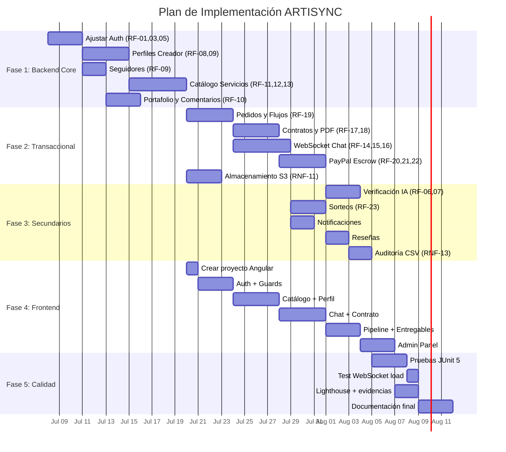

# 🗺️ Guía Completa para Completar ARTISYNC

## Estado Actual del Proyecto vs. Requisitos de Entrega 1A

Este documento analiza **todo** lo que existe en el repositorio actual y lo contrasta con los 23 requisitos funcionales (RF-01 a RF-23), los 14 requisitos no funcionales (RNF-01 a RNF-14), y los entregables definidos en el documento [Entrega 1A.md](file:///d:/Proyecto/Proyecto-WEB-ARTISYNC/Entrega%201A.md).

---

## 1. Inventario del Estado Actual

### ✅ Lo que YA existe

| Componente | Estado | Archivos clave |
|---|---|---|
| **Estructura Spring Boot 4.1** | ✅ Configurado | [pom.xml](file:///d:/Proyecto/Proyecto-WEB-ARTISYNC/artisync/Backend/pom.xml) |
| **Docker Compose** | ✅ PostgreSQL + Redis + Backend + Frontend (placeholder) | [docker-compose.yml](file:///d:/Proyecto/Proyecto-WEB-ARTISYNC/artisync/docker-compose.yml) |
| **Flyway Migrations** | ✅ Schema completo (42 tablas, 7 módulos) | `V1__schema_inicial.sql`, `V2__ajustes_requisitos_pfc.sql` |
| **Entidades JPA** (todas las 42 tablas) | ✅ Todas mapeadas | Paquetes `entity.seguridad`, `entity.perfil`, `entity.catalogo`, `entity.pedido`, `entity.operaciones`, `entity.comunicacion`, `entity.social` |
| **Repositorios JPA** | ⚠️ Parcial (~20 de ~42) | Paquete `repository/` |
| **Auth: Registro, Login, Logout, Refresh** | ✅ Funcional | [AuthController.java](file:///d:/Proyecto/Proyecto-WEB-ARTISYNC/artisync/Backend/src/main/java/uteq/edu/ec/artisync/controller/AuthController.java) + [AuthServiceImpl.java](file:///d:/Proyecto/Proyecto-WEB-ARTISYNC/artisync/Backend/src/main/java/uteq/edu/ec/artisync/service/impl/AuthServiceImpl.java) |
| **JWT con blacklist Redis** | ✅ Funcional | [JwtService.java](file:///d:/Proyecto/Proyecto-WEB-ARTISYNC/artisync/Backend/src/main/java/uteq/edu/ec/artisync/security/JwtService.java), [SessionRevocationService.java](file:///d:/Proyecto/Proyecto-WEB-ARTISYNC/artisync/Backend/src/main/java/uteq/edu/ec/artisync/service/shared/SessionRevocationService.java) |
| **Spring Security + RBAC** | ✅ Configurado | [SecurityConfig.java](file:///d:/Proyecto/Proyecto-WEB-ARTISYNC/artisync/Backend/src/main/java/uteq/edu/ec/artisync/config/SecurityConfig.java) |
| **2FA TOTP** | ✅ Funcional | [TwoFactorController.java](file:///d:/Proyecto/Proyecto-WEB-ARTISYNC/artisync/Backend/src/main/java/uteq/edu/ec/artisync/controller/TwoFactorController.java) |
| **Gestión de Roles y Permisos** | ✅ CRUD Admin | `RolePermissionController`, `PermissionController` |
| **CRUD Usuarios (Admin)** | ✅ Funcional | [AdminUserController.java](file:///d:/Proyecto/Proyecto-WEB-ARTISYNC/artisync/Backend/src/main/java/uteq/edu/ec/artisync/controller/AdminUserController.java) |
| **Perfil de usuario autenticado** | ✅ Funcional | [UserController.java](file:///d:/Proyecto/Proyecto-WEB-ARTISYNC/artisync/Backend/src/main/java/uteq/edu/ec/artisync/controller/UserController.java) |
| **Recuperación de contraseña (Email SMTP)** | ✅ Funcional | [EmailService.java](file:///d:/Proyecto/Proyecto-WEB-ARTISYNC/artisync/Backend/src/main/java/uteq/edu/ec/artisync/service/shared/EmailService.java) |
| **Paginación genérica** | ✅ Implementado | `PagedResponse`, `PagedResponseBuilder` |
| **Swagger/OpenAPI** | ✅ Configurado | [OpenApiConfig.java](file:///d:/Proyecto/Proyecto-WEB-ARTISYNC/artisync/Backend/src/main/java/uteq/edu/ec/artisync/config/OpenApiConfig.java) |
| **Manejo global de excepciones** | ✅ Configurado | [GlobalExceptionHandler.java](file:///d:/Proyecto/Proyecto-WEB-ARTISYNC/artisync/Backend/src/main/java/uteq/edu/ec/artisync/config/GlobalExceptionHandler.java) |
| **País (catálogo)** | ✅ CRUD | [PaisController.java](file:///d:/Proyecto/Proyecto-WEB-ARTISYNC/artisync/Backend/src/main/java/uteq/edu/ec/artisync/controller/PaisController.java) |

### ❌ Lo que FALTA

| Componente | Prioridad | RF relacionados |
|---|---|---|
| **Frontend Angular completo** | 🔴 CRÍTICO | Todos — No existe el directorio `Frontend/` |
| **Módulo Perfiles de Creador** (API) | 🔴 Alta | RF-08, RF-09 |
| **Módulo Portafolio** (API) | 🔴 Alta | RF-09, RF-10 |
| **Módulo Catálogo de Servicios** (API + búsqueda) | 🔴 Alta | RF-11, RF-12, RF-13 |
| **Módulo Pedidos y Flujos de Trabajo** (API) | 🔴 Alta | RF-19 |
| **Módulo Contratos y Firma Electrónica** (API) | 🔴 Alta | RF-17, RF-18 |
| **Módulo Mensajería WebSocket** | 🔴 Alta | RF-14, RF-15, RF-16 |
| **Módulo Pagos PayPal (Escrow)** | 🔴 Alta | RF-20, RF-21, RF-22 |
| **Módulo Verificación por IA** | 🟡 Media | RF-06, RF-07 |
| **Módulo Sorteos** | 🟡 Media | RF-23 |
| **Módulo Seguidores** | 🔴 Alta | RF-09 |
| **Módulo Comentarios** | 🟡 Media | RF-10 |
| **Módulo Notificaciones** | 🔴 Alta | RF-09, RF-14, RF-15, RF-19, RF-20 |
| **Generación de PDF** (contratos) | 🔴 Alta | RF-18 |
| **Almacenamiento S3/R2** | 🔴 Alta | RNF-11 |
| **Pruebas JUnit 5 / MockMvc** | 🔴 Alta | RNF-10, cronograma S7, S12 |
| **GitHub Actions CI** | 🟡 Media | Estructura del repo |
| **Documentación técnica final** | 🟡 Media | S15 Entrega 1B |

---

## 2. Matriz de Cobertura RF por RF

### Módulo 1: Autenticación y Seguridad (M1)

| RF | Descripción | Estado | Qué falta |
|---|---|---|---|
| **RF-01** | Registro con selección de rol (Creador/Cliente) | ⚠️ Parcial | El registro existe, pero falta la **selección de rol** al registrarse. Actualmente se registra sin rol; falta validar que el endpoint asigne `CREADOR` o `CLIENTE` y que el middleware redirija según el rol. |
| **RF-02** | RBAC con permisos dinámicos | ✅ Completo | Tablas `roles`, `permisos`, `rol_permisos` + Spring Security configurado. CRUD admin para roles/permisos ya existe. |
| **RF-03** | JWT con expiración 24h, blacklist | ⚠️ Parcial | JWT funcional, pero la expiración actual es **1 hora** (`3600000ms`). Debe cambiarse a **24 horas** (`86400000ms`) según RF-03. |
| **RF-04** | Recuperación de contraseña (enlace único, 60min) | ✅ Completo | `EmailService` + `TokenRecuperacion` implementados. |
| **RF-05** | 2FA TOTP opcional (solo verificados) | ⚠️ Parcial | 2FA funcional, pero falta la **condición** de solo permitir activación a usuarios con identidad verificada. |

---

### Módulo 2: Perfiles y Verificación (M2)

| RF | Descripción | Estado | Qué falta |
|---|---|---|---|
| **RF-06** | Verificación de identidad con IA | ❌ No implementado | Falta: endpoint de carga de documento, integración con servicio de IA externo, actualización de estado de verificación, eliminación del documento tras respuesta. Entidad `CertificadoIa` y `EstadoVerificacion` ya existen. |
| **RF-07** | Certificados profesionales con IA (sello) | ❌ No implementado | Similar a RF-06. Falta: umbral configurable por admin, lógica de puntaje de confianza, sello visual en perfil. |
| **RF-08** | Personalización de perfil público | ❌ No implementado | Falta: Controller + Service para `PerfilCreador`. CRUD de foto (validar JPG/PNG, max 5MB), biografía (max 500 chars, sin datos de contacto), URLs de redes sociales. Entidad `PerfilCreador` ya mapeada. |
| **RF-09** | Perfil público con métricas + seguir/dejar de seguir | ❌ No implementado | Falta: endpoint público del perfil con total seguidores, servicios activos, promedio calificaciones, estado verificación. Endpoint de seguir/dejar de seguir. Entidades `Seguidor`, `PerfilCreador` ya existen. |

---

### Módulo 3: Catálogo Dinámico de Servicios (M3)

| RF | Descripción | Estado | Qué falta |
|---|---|---|---|
| **RF-10** | Comentarios en portafolio (soft delete) | ❌ No implementado | Falta: CRUD de comentarios, soft delete (`estado_moderacion`), panel admin para ver eliminados. Entidad `ComentarioPortafolio` ya existe. |
| **RF-11** | Publicar Producto/Servicio en catálogo | ❌ No implementado | Falta: Controller + Service para `Servicio`. Diferenciar tipo Producto vs Servicio. Validar precio mínimo 0.01, imagen obligatoria (JPG/PNG max 10MB), descripción 20-2000 chars. Entidades ya mapeadas. |
| **RF-12** | Atributos personalizados dinámicos por ítem | ❌ No implementado | Falta: CRUD de `ServicioAtributo` (max 10 por servicio), formulario dinámico según categoría. Entidades `AtributoDinamico`, `ServicioAtributo` ya existen. |
| **RF-13** | Motor de búsqueda con filtros | ❌ No implementado | Falta: endpoint de búsqueda con filtros por categoría, subcategoría, rango de precio, etiquetas; búsqueda textual sobre título y descripción (case-insensitive). |

---

### Módulo 4: Flujos de Trabajo y Pedidos (M4)

| RF | Descripción | Estado | Qué falta |
|---|---|---|---|
| **RF-19** | Flujo de trabajo con etapas configurables | ❌ No implementado | Falta: CRUD de `FlujoTrabajo` + `FlujoEtapaConfig`, transición de etapas con registro en `HistorialEstadoPedido`, vista de seguimiento en tiempo real. Entidades ya mapeadas. |

---

### Módulo 5: Legal, Entregables y Finanzas (M5)

| RF | Descripción | Estado | Qué falta |
|---|---|---|---|
| **RF-17** | Generación automática de contrato HTML | ❌ No implementado | Falta: motor de templates con variables sustituibles, servicio de generación a partir de `PlantillaContrato`. |
| **RF-18** | Firma electrónica + descarga PDF | ❌ No implementado | Falta: endpoint de firma (click explícito), generación de hash de firma, bloqueo hasta ambas firmas, generación de PDF. Dependencia para PDF no está en `pom.xml` (necesita `itext` o `openhtmltopdf`). |
| **RF-20** | PayPal Orders v2 (Escrow) | ❌ No implementado | Falta: integración con API de PayPal, generación de enlaces de pago, webhook handler, verificación de firma del webhook. SDK de PayPal no está en `pom.xml`. |
| **RF-21** | Entregables con marca de agua + liberación de fondos | ❌ No implementado | Falta: upload de entregable con marca de agua, lógica de liberación, descarga de versión limpia. |
| **RF-22** | Cargo por revisión adicional | ❌ No implementado | Falta: configuración de cargo extra, creación automática de enlace PayPal al superar límite, timeout de 48h. |

---

### Módulo 6: Comunicación y Notificaciones (M6)

| RF | Descripción | Estado | Qué falta |
|---|---|---|---|
| **RF-14** | Mensajería WebSocket en tiempo real | ❌ No implementado | Falta: configuración de WebSocket (Spring WebSocket / STOMP), creación automática de sala al firmar contrato, cierre al entregar/cancelar. Dependencia WebSocket no está en `pom.xml`. |
| **RF-15** | Detección de datos de contacto en mensajes | ❌ No implementado | Falta: filtro regex para teléfonos/correos, sistema de infracciones (3 en 30 días → suspensión 15 días). Entidad `InfraccionMensaje` ya existe. |
| **RF-16** | Formulario de briefing en chat | ❌ No implementado | Falta: CRUD de preguntas del briefing, renderización como elemento interactivo en chat, respuestas inmutables post-envío. |

---

### Módulo 7: Social, Comunidad y Sorteos (M7)

| RF | Descripción | Estado | Qué falta |
|---|---|---|---|
| **RF-23** | Sorteos configurables | ❌ No implementado | Falta: CRUD de `Sorteo` + `ParticipanteSorteo`, selección aleatoria de ganadores al cierre, validación de requisito de seguidor, notificación. Entidades ya existen. |

---

## 3. Matriz de Cobertura RNF

| RNF | Categoría | Estado | Qué falta |
|---|---|---|---|
| **RNF-01** | Seguridad (HTTPS/TLS) | ⚠️ Pendiente despliegue | Configurar en Nginx/reverse proxy. No aplica en dev local. |
| **RNF-02** | Seguridad (bcrypt 10+) | ✅ Implementado | BCrypt configurado en Spring Security. Verificar factor de coste. |
| **RNF-03** | Seguridad (JWT HS256) | ✅ Implementado | `jjwt` con HS256. Clave en `application.properties` como variable de entorno. |
| **RNF-04** | Rendimiento (LCP ≤ 2s) | ❌ Sin frontend | Requiere frontend Angular optimizado + Lighthouse. |
| **RNF-05** | Rendimiento (WebSocket 10 conexiones) | ❌ Sin WebSocket | Requiere implementar WebSocket + script de prueba de carga. |
| **RNF-06** | Rendimiento (PDF ≤ 5s) | ❌ Sin generación PDF | Requiere implementar generación de PDF + timestamps en log. |
| **RNF-07** | Usabilidad (Responsive 360/768/1440) | ❌ Sin frontend | Requiere Angular + Bootstrap 5 responsive. |
| **RNF-08** | Usabilidad (Formularios dinámicos, ≤5 pasos) | ❌ Sin frontend | Requiere formularios reactivos Angular. |
| **RNF-09** | Disponibilidad (PM2/systemd) | ⚠️ Docker solo | Docker restart policy configurada (`unless-stopped`). Suficiente para evaluación. |
| **RNF-10** | Escalabilidad (módulos desacoplados) | ⚠️ Parcial | Verificar que WebSocket, API REST y PDF no tengan imports cruzados. |
| **RNF-11** | Almacenamiento (S3/R2) | ❌ No implementado | Falta SDK AWS S3 en `pom.xml`, servicio de upload/download. |
| **RNF-12** | Privacidad (bloquear menores 18) | ❌ No implementado | Falta validación de fecha de nacimiento en registro, checkbox de términos. |
| **RNF-13** | Trazabilidad (audit trail) | ⚠️ Parcial | Tablas de historial existen, pero no hay endpoints bloqueados para DELETE/PATCH. Falta exportación CSV. |
| **RNF-14** | Integración (PayPal webhook verification) | ❌ No implementado | Falta SDK PayPal + verificación de firma del webhook. |

---

## 4. Plan de Implementación por Fases

> [!IMPORTANT]
> El orden propuesto sigue las dependencias técnicas entre módulos y se alinea con el cronograma semanal del documento Entrega 1A.

---

### 🔵 FASE 1: Completar el Backend Core (Semana 10-11)

#### 1.1 Ajustar Autenticación (RF-01, RF-03, RF-05)

**Archivos a modificar:**

- [application.properties](file:///d:/Proyecto/Proyecto-WEB-ARTISYNC/artisync/Backend/src/main/resources/application.properties): Cambiar `JWT_EXPIRATION` de `3600000` a `86400000` (24h)
- [AuthServiceImpl.java](file:///d:/Proyecto/Proyecto-WEB-ARTISYNC/artisync/Backend/src/main/java/uteq/edu/ec/artisync/service/impl/AuthServiceImpl.java): Agregar selección de rol (Creador/Cliente) al DTO de registro
- [TwoFactorServiceImpl.java](file:///d:/Proyecto/Proyecto-WEB-ARTISYNC/artisync/Backend/src/main/java/uteq/edu/ec/artisync/service/impl/TwoFactorServiceImpl.java): Condicionar activación de 2FA a estado de verificación

**Nuevos DTOs necesarios:**
```
dto/request/RegistroConRolRequest.java  — {nombres, apellidos, correo, contrasena, rol: "CREADOR"|"CLIENTE", fechaNacimiento, aceptaTerminos}
```

**Validaciones a agregar:**
- Bloquear registro de menores de 18 (RNF-12)
- Checkbox obligatorio de términos y política de privacidad (RNF-12)

---

#### 1.2 Módulo de Perfiles de Creador (RF-08, RF-09)

**Nuevos archivos:**

```
controller/PerfilCreadorController.java
service/PerfilCreadorService.java
service/impl/PerfilCreadorServiceImpl.java
dto/request/ActualizarPerfilRequest.java   — {biografia, urlRedSocial1, urlRedSocial2, urlRedSocial3}
dto/response/PerfilPublicoResponse.java    — {id, nombres, biografia, urlsRedes, totalSeguidores, serviciosActivos, promedioCalificaciones, estadoVerificacion, selloVerificado}
```

**Endpoints:**
```
PUT    /api/creadores/perfil          — Actualizar perfil propio
GET    /api/creadores/{id}/perfil     — Ver perfil público
POST   /api/creadores/{id}/foto       — Subir foto de perfil (multipart, JPG/PNG, max 5MB)
```

**Validaciones clave:**
- Biografía: max 500 chars, regex para detectar teléfonos (`\+?\d[\d\-\s]{7,}`) y correos (`\S+@\S+\.\S+`) → rechazar
- Foto: validar MIME type + tamaño ≤ 5MB
- URLs: validar formato URL válida

---

#### 1.3 Módulo de Seguidores (RF-09)

**Nuevos archivos:**

```
controller/SeguidorController.java
service/SeguidorService.java
service/impl/SeguidorServiceImpl.java
repository/SeguidorRepository.java   — (ya existe, verificar métodos)
```

**Endpoints:**
```
POST   /api/creadores/{id}/seguir       — Seguir a un creador
DELETE /api/creadores/{id}/seguir       — Dejar de seguir
GET    /api/creadores/{id}/seguidores   — Listar seguidores
GET    /api/usuarios/me/siguiendo       — Listar creadores que sigo
```

---

#### 1.4 Módulo de Catálogo de Servicios (RF-11, RF-12, RF-13)

**Nuevos archivos:**

```
controller/ServicioController.java
controller/CategoriaController.java
service/ServicioService.java
service/impl/ServicioServiceImpl.java
service/CategoriaService.java
service/impl/CategoriaServiceImpl.java
dto/request/CrearServicioRequest.java
dto/request/BusquedaServicioRequest.java
dto/response/ServicioResponse.java
dto/response/ServicioCatalogoResponse.java
repository/CategoriaRepository.java
repository/SubcategoriaRepository.java
repository/EtiquetaRepository.java
repository/ServicioEtiquetaRepository.java
repository/AtributoDinamicoRepository.java
repository/ServicioAtributoRepository.java
```

**Endpoints:**
```
# Categorías
GET    /api/categorias                        — Listar categorías activas
GET    /api/categorias/{id}/subcategorias     — Listar subcategorías

# Servicios
POST   /api/servicios                         — Crear servicio/producto
PUT    /api/servicios/{id}                    — Editar servicio
GET    /api/servicios/{id}                    — Detalle del servicio
DELETE /api/servicios/{id}                    — Eliminar servicio
GET    /api/catalogo                          — Buscar con filtros (categoría, subcategoría, precio min/max, etiquetas, texto)

# Atributos dinámicos
POST   /api/servicios/{id}/atributos          — Añadir atributo (max 10)
PUT    /api/servicios/{id}/atributos/{attrId} — Editar atributo
DELETE /api/servicios/{id}/atributos/{attrId} — Eliminar atributo
```

**Validaciones clave:**
- Precio: min 0.01 USD
- Imagen obligatoria: JPG/PNG, max 10MB
- Descripción: entre 20 y 2000 caracteres
- Máximo 10 atributos por servicio
- Nombre atributo: max 100 chars, valor: max 255 chars

---

#### 1.5 Módulo de Portafolio y Comentarios (RF-09, RF-10)

**Nuevos archivos:**

```
controller/PortafolioController.java
controller/ComentarioController.java
service/PortafolioService.java
service/impl/PortafolioServiceImpl.java
service/ComentarioService.java
service/impl/ComentarioServiceImpl.java
repository/PortafolioItemRepository.java
repository/ComentarioPortafolioRepository.java
repository/LikePortafolioRepository.java
dto/request/CrearPortafolioItemRequest.java
dto/response/PortafolioItemResponse.java
dto/response/ComentarioResponse.java
```

**Endpoints:**
```
# Portafolio
GET    /api/creadores/{id}/portafolio         — Ver portafolio público
POST   /api/portafolio/items                   — Subir ítem al portafolio
DELETE /api/portafolio/items/{id}              — Eliminar ítem

# Comentarios
POST   /api/portafolio/items/{id}/comentarios — Crear comentario
DELETE /api/portafolio/items/{id}/comentarios/{commentId} — Eliminar (soft delete por creador)
GET    /api/admin/comentarios/eliminados       — Admin: ver comentarios eliminados

# Likes
POST   /api/portafolio/items/{id}/like        — Dar like
DELETE /api/portafolio/items/{id}/like        — Quitar like
```

---

### 🟢 FASE 2: Módulos Transaccionales (Semana 12)

#### 2.1 Módulo de Pedidos y Flujos de Trabajo (RF-19)

**Nuevos archivos:**

```
controller/PedidoController.java
controller/FlujoTrabajoController.java
service/PedidoService.java
service/impl/PedidoServiceImpl.java
service/FlujoTrabajoService.java
service/impl/FlujoTrabajoServiceImpl.java
dto/request/CrearPedidoRequest.java
dto/response/PedidoResponse.java
dto/response/SeguimientoPedidoResponse.java
```

**Endpoints:**
```
# Flujos (Admin/Creador)
POST   /api/flujos                            — Crear flujo de trabajo
GET    /api/flujos                            — Listar flujos
PUT    /api/flujos/{id}/etapas                — Configurar etapas

# Pedidos
POST   /api/pedidos                           — Crear pedido (cliente solicita servicio)
GET    /api/pedidos/{id}                      — Ver detalle del pedido
GET    /api/pedidos/mis-pedidos               — Pedidos del cliente
GET    /api/pedidos/mis-comisiones            — Pedidos del creador
PUT    /api/pedidos/{id}/avanzar              — Avanzar a siguiente etapa (creador)
GET    /api/pedidos/{id}/historial            — Historial de estados (inmutable)
```

**Lógica clave:**
- Cada transición registra `HistorialEstadoPedido` con timestamp automático
- Los registros de historial NO pueden ser eliminados ni modificados (RNF-13)
- El endpoint debe devolver HTTP 403 para intentos de DELETE/PATCH al historial

---

#### 2.2 Módulo de Contratos y Firma Electrónica (RF-17, RF-18)

**Dependencias a agregar al pom.xml:**
```xml
<!-- PDF Generation -->
<dependency>
    <groupId>com.openhtmltopdf</groupId>
    <artifactId>openhtmltopdf-pdfbox</artifactId>
    <version>1.1.22</version>
</dependency>
```

**Nuevos archivos:**

```
controller/ContratoController.java
service/ContratoService.java
service/impl/ContratoServiceImpl.java
service/PdfGenerationService.java
service/impl/PdfGenerationServiceImpl.java
dto/request/FirmarContratoRequest.java
dto/response/ContratoResponse.java
```

**Endpoints:**
```
POST   /api/pedidos/{id}/contrato            — Generar contrato (automático tras briefing)
GET    /api/contratos/{id}                   — Ver contrato HTML
POST   /api/contratos/{id}/firmar            — Firmar contrato (click explícito)
GET    /api/contratos/{id}/pdf               — Descargar contrato como PDF
```

**Lógica clave:**
- Generar contrato sustituyendo variables en `PlantillaContrato.cuerpo_html_plantilla`
- Variables: `{nombre_creador}`, `{nombre_cliente}`, `{descripcion_servicio}`, `{precio}`, `{limite_revisiones}`, `{fecha_entrega}`
- Firma: generar hash SHA-256 del contenido + timestamp + userId
- PDF: renderizar HTML a PDF con `openhtmltopdf`, incluir hashes de firma en pie
- Pedido no avanza hasta que ambas partes firmen

---

#### 2.3 Módulo de Mensajería WebSocket (RF-14, RF-15, RF-16)

**Dependencias a agregar al pom.xml:**
```xml
<!-- WebSocket -->
<dependency>
    <groupId>org.springframework.boot</groupId>
    <artifactId>spring-boot-starter-websocket</artifactId>
</dependency>
```

**Nuevos archivos:**

```
config/WebSocketConfig.java
controller/ChatController.java
controller/ws/ChatWebSocketHandler.java
service/ChatService.java
service/impl/ChatServiceImpl.java
service/MensajeFilterService.java         — Detección de datos de contacto
service/impl/MensajeFilterServiceImpl.java
service/InfraccionService.java
service/impl/InfraccionServiceImpl.java
dto/request/EnviarMensajeRequest.java
dto/request/BriefingFormRequest.java
dto/response/MensajeResponse.java
dto/response/SalaChatResponse.java
```

**Endpoints REST (backup):**
```
GET    /api/pedidos/{id}/chat/mensajes       — Historial de mensajes
POST   /api/pedidos/{id}/chat/mensajes       — Enviar mensaje (REST fallback)
POST   /api/pedidos/{id}/chat/briefing       — Enviar formulario de briefing
```

**WebSocket:**
```
ws://localhost:8080/ws/chat                  — Endpoint WebSocket
/topic/sala.{salaId}                         — Suscripción STOMP por sala
/app/chat.enviar                             — Enviar mensaje via STOMP
```

**Lógica clave:**
- Sala se crea automáticamente al firmarse contrato
- Sala se cierra cuando pedido llega a estado `Entregado` o `Cancelado`
- Filtro regex: `(\+?\d[\d\-\s]{7,})` para teléfonos, `[\w.+-]+@[\w-]+\.[\w.]+` para emails
- Mensaje bloqueado → no se entrega, se incrementa contador de infracciones
- 3 infracciones en 30 días → suspensión temporal 15 días
- Briefing: hasta 10 preguntas de texto libre, respuestas inmutables post-envío

---

#### 2.4 Módulo de Pagos PayPal Escrow (RF-20, RF-21, RF-22)

**Dependencias a agregar al pom.xml:**
```xml
<!-- PayPal SDK -->
<dependency>
    <groupId>com.paypal.sdk</groupId>
    <artifactId>checkout-sdk</artifactId>
    <version>2.0.0</version>
</dependency>
```

**Variables de entorno a agregar al `.env.example`:**
```
PAYPAL_CLIENT_ID=sandbox_client_id
PAYPAL_CLIENT_SECRET=sandbox_client_secret
PAYPAL_MODE=sandbox
PAYPAL_WEBHOOK_ID=webhook_id
```

**Nuevos archivos:**

```
config/PayPalConfig.java
controller/PagoController.java
controller/PayPalWebhookController.java
service/PagoService.java
service/impl/PagoServiceImpl.java
service/EntregableService.java
service/impl/EntregableServiceImpl.java
dto/request/AprobarEntregaRequest.java
dto/response/PagoResponse.java
dto/response/EntregableResponse.java
```

**Endpoints:**
```
POST   /api/pedidos/{id}/pago                — Crear orden PayPal
POST   /api/webhooks/paypal                  — Webhook PayPal (verificar firma)
GET    /api/pedidos/{id}/entregable          — Ver entregable (marca de agua)
POST   /api/pedidos/{id}/entregable          — Subir entregable (creador)
POST   /api/pedidos/{id}/aprobar             — Aprobar trabajo (liberar fondos + descarga limpia)
POST   /api/pedidos/{id}/revision            — Solicitar revisión (puede generar cargo extra)
GET    /api/pedidos/{id}/entregable/descargar — Descargar versión limpia (post-aprobación)
```

---

#### 2.5 Módulo de Almacenamiento S3/R2 (RNF-11)

**Dependencias a agregar al pom.xml:**
```xml
<!-- AWS SDK v2 for S3 (compatible con R2) -->
<dependency>
    <groupId>software.amazon.awssdk</groupId>
    <artifactId>s3</artifactId>
    <version>2.29.0</version>
</dependency>
```

**Variables de entorno:**
```
S3_ENDPOINT=https://your-account.r2.cloudflarestorage.com
S3_ACCESS_KEY=your_access_key
S3_SECRET_KEY=your_secret_key
S3_BUCKET_NAME=artisync-files
S3_REGION=auto
```

**Nuevos archivos:**

```
config/S3Config.java
service/shared/StorageService.java
service/shared/impl/S3StorageServiceImpl.java
```

**Métodos del servicio:**
```java
String uploadFile(MultipartFile file, String path);
void deleteFile(String url);
String generatePresignedUrl(String key, Duration expiration);
```

---

### 🟡 FASE 3: Módulos Secundarios (Semana 13-14)

#### 3.1 Módulo de Verificación con IA (RF-06, RF-07)

**Nuevos archivos:**

```
controller/VerificacionController.java
service/VerificacionService.java
service/impl/VerificacionServiceImpl.java
service/shared/IaVerificationClient.java
```

**Endpoints:**
```
POST   /api/creadores/verificacion/identidad        — Cargar documento de identidad
POST   /api/creadores/verificacion/certificado      — Cargar certificado profesional
GET    /api/creadores/verificacion/estado            — Consultar estado de verificación
PUT    /api/admin/verificacion/umbral                — Admin: cambiar umbral de confianza IA
```

---

#### 3.2 Módulo de Sorteos (RF-23)

**Nuevos archivos:**

```
controller/SorteoController.java
service/SorteoService.java
service/impl/SorteoServiceImpl.java
dto/request/CrearSorteoRequest.java
dto/response/SorteoResponse.java
```

**Endpoints:**
```
POST   /api/sorteos                                 — Crear sorteo (creador)
GET    /api/sorteos/{id}                            — Ver detalle
POST   /api/sorteos/{id}/participar                 — Inscribirse
GET    /api/sorteos/{id}/ganadores                  — Ver ganadores (post-cierre)
GET    /api/creadores/{id}/sorteos                  — Sorteos de un creador
```

**Lógica clave:**
- Validar requisito de seguidor
- No permitir editar `cantidad_ganadores` si ya hay participantes
- Scheduled task (`@Scheduled`) para ejecutar selección al llegar `fecha_cierre`
- Notificar ganadores

---

#### 3.3 Módulo de Notificaciones (transversal)

**Nuevos archivos:**

```
controller/NotificacionController.java
service/NotificacionService.java
service/impl/NotificacionServiceImpl.java
repository/NotificacionSistemaRepository.java
repository/TipoNotificacionRepository.java
dto/response/NotificacionResponse.java
```

**Endpoints:**
```
GET    /api/notificaciones                          — Listar notificaciones del usuario
PUT    /api/notificaciones/{id}/leer                — Marcar como leída
GET    /api/notificaciones/no-leidas/count           — Contador de no leídas
```

---

#### 3.4 Módulo de Reseñas (complemento)

**Nuevos archivos:**

```
controller/ResenaController.java
service/ResenaService.java
service/impl/ResenaServiceImpl.java
dto/request/CrearResenaRequest.java
dto/response/ResenaResponse.java
```

**Endpoints:**
```
POST   /api/pedidos/{id}/resena                    — Crear reseña (1-5 estrellas, solo post-entrega)
GET    /api/creadores/{id}/resenas                 — Listar reseñas de un creador
```

---

#### 3.5 Trazabilidad y Exportación CSV (RNF-13)

**Nuevos archivos:**

```
controller/AuditController.java
service/AuditService.java
service/impl/AuditServiceImpl.java
```

**Endpoints:**
```
GET    /api/admin/transacciones/{creadorId}/csv     — Exportar historial de transacciones CSV
DELETE /api/pedidos/{id}/historial                   — ❌ Retornar 403 SIEMPRE
PATCH  /api/pedidos/{id}/historial                   — ❌ Retornar 403 SIEMPRE
```

---

### 🔴 FASE 4: Frontend Angular (Semana 13-15)

> [!CAUTION]
> **No existe ningún directorio Frontend.** Es el componente más grande que falta y debe crearse desde cero.

#### 4.1 Crear Proyecto Angular

```bash
cd artisync
npx -y @angular/cli@19 new Frontend --routing --style=css --ssr=false --skip-git
```

**Dependencias adicionales:**
```bash
cd Frontend
npm install bootstrap@5 @ng-bootstrap/ng-bootstrap
npm install @stomp/stompjs sockjs-client
npm install jwt-decode
npm install ngx-toastr
```

#### 4.2 Estructura de Módulos Angular

```
Frontend/src/app/
├── core/
│   ├── guards/
│   │   ├── auth.guard.ts              — Proteger rutas autenticadas
│   │   ├── role.guard.ts              — Proteger rutas por rol (CREADOR/CLIENTE/ADMIN)
│   │   └── no-auth.guard.ts           — Redirigir si ya está logueado
│   ├── interceptors/
│   │   ├── auth.interceptor.ts        — Agregar JWT a las peticiones
│   │   └── error.interceptor.ts       — Manejo global de errores HTTP
│   ├── services/
│   │   ├── auth.service.ts
│   │   ├── user.service.ts
│   │   ├── storage.service.ts         — LocalStorage/SessionStorage
│   │   └── websocket.service.ts       — Conexión STOMP
│   └── models/
│       ├── user.model.ts
│       ├── token-response.model.ts
│       └── api-response.model.ts
│
├── features/
│   ├── auth/
│   │   ├── login/
│   │   ├── register/
│   │   ├── forgot-password/
│   │   ├── reset-password/
│   │   └── two-factor/
│   │
│   ├── catalogo/
│   │   ├── catalogo-page/             — Búsqueda con filtros (RF-13)
│   │   ├── servicio-detalle/          — Detalle de un servicio
│   │   └── servicio-form/             — Crear/Editar servicio (RF-11, RF-12)
│   │
│   ├── perfil/
│   │   ├── perfil-publico/            — Vista pública del creador (RF-09)
│   │   ├── perfil-editar/             — Editar perfil propio (RF-08)
│   │   └── portafolio/               — Gestión de portafolio
│   │
│   ├── pedidos/
│   │   ├── mis-pedidos/               — Lista de pedidos (cliente)
│   │   ├── mis-comisiones/            — Lista de comisiones (creador)
│   │   ├── pedido-detalle/            — Detalle + seguimiento (RF-19)
│   │   └── pipeline/                  — Vista Kanban para creador (RF-19)
│   │
│   ├── chat/
│   │   ├── sala-chat/                 — Chat en tiempo real (RF-14)
│   │   ├── briefing-form/             — Formulario de briefing (RF-16)
│   │   └── contrato-viewer/           — Visor de contrato + firma (RF-17, RF-18)
│   │
│   ├── entregables/
│   │   ├── entregable-preview/        — Previsualización con marca de agua (RF-21)
│   │   └── entregable-actions/        — Aprobar/Revisar (RF-21, RF-22)
│   │
│   ├── sorteos/
│   │   ├── sorteo-list/               — Lista de sorteos
│   │   ├── sorteo-crear/              — Crear sorteo (RF-23)
│   │   └── sorteo-detalle/            — Detalle + participar
│   │
│   ├── admin/
│   │   ├── dashboard/
│   │   ├── usuarios/                  — Gestión de usuarios
│   │   ├── roles-permisos/            — Gestión RBAC
│   │   ├── categorias/                — Gestión de categorías
│   │   ├── reportes/                  — Exportación CSV (RNF-13)
│   │   └── verificaciones/            — Panel de verificaciones IA
│   │
│   └── notificaciones/
│       └── notificacion-list/         — Centro de notificaciones
│
├── shared/
│   ├── components/
│   │   ├── navbar/
│   │   ├── footer/
│   │   ├── sidebar/
│   │   ├── star-rating/
│   │   ├── pagination/
│   │   └── loading-spinner/
│   └── pipes/
│       └── time-ago.pipe.ts
│
└── app.routes.ts                      — Rutas lazy-loaded
```

#### 4.3 Interfaces Clave del Frontend (Entrega 1A §6)

| Interfaz | Sección en Entrega 1A | Componentes Angular |
|---|---|---|
| **6.1 Catálogo Inteligente** | Filtros + grilla de servicios | `catalogo-page` con panel lateral de filtros |
| **6.2 Perfil Público del Creador** | Métricas + portafolio + servicios | `perfil-publico` con tabs |
| **6.3 Sala de Operaciones** | Chat + contrato (split-screen) | `sala-chat` + `contrato-viewer` layout dividido |
| **6.4 Pipeline de Producción** | Kanban board | `pipeline` con columnas drag & drop |
| **6.5 Entrega Final y Escrow** | Preview marca de agua + acciones | `entregable-preview` + `entregable-actions` |

#### 4.4 Dockerfile del Frontend

```dockerfile
# Frontend/Dockerfile
FROM node:20-alpine AS build
WORKDIR /app
COPY package*.json ./
RUN npm ci
COPY . .
RUN npm run build -- --configuration production

FROM nginx:1.25-alpine
COPY --from=build /app/dist/frontend/browser /usr/share/nginx/html
COPY nginx.conf /etc/nginx/conf.d/default.conf
EXPOSE 4200
```

```nginx
# Frontend/nginx.conf
server {
    listen 4200;
    root /usr/share/nginx/html;
    index index.html;

    location / {
        try_files $uri $uri/ /index.html;
    }

    location /api/ {
        proxy_pass http://backend:8080/api/;
        proxy_set_header Host $host;
        proxy_set_header X-Real-IP $remote_addr;
    }

    location /ws/ {
        proxy_pass http://backend:8080/ws/;
        proxy_http_version 1.1;
        proxy_set_header Upgrade $http_upgrade;
        proxy_set_header Connection "upgrade";
    }
}
```

---

### 🟣 FASE 5: Pruebas y Documentación (Semana 15-16)

#### 5.1 Pruebas JUnit 5 + MockMvc

**Archivos de prueba necesarios:**

```
src/test/java/uteq/edu/ec/artisync/
├── controller/
│   ├── AuthControllerTest.java         — Registro, login, logout, refresh
│   ├── ServicioControllerTest.java     — CRUD de servicios + búsqueda
│   ├── PedidoControllerTest.java       — Crear pedido, avanzar etapa
│   ├── ContratoControllerTest.java     — Generar contrato, firmar
│   └── ChatControllerTest.java         — Enviar mensaje, detectar contacto
├── service/
│   ├── AuthServiceTest.java
│   ├── MensajeFilterServiceTest.java   — Regex detección teléfono/email
│   ├── PagoServiceTest.java
│   └── SorteoServiceTest.java
└── security/
    └── JwtServiceTest.java
```

**Mínimo requerido:** ≥5 pruebas en verde (pero se recomienda ≥20 para cubrir los RF críticos)

#### 5.2 Script de prueba de WebSocket (RNF-05)

```
tests/websocket-load-test.js            — Script Node.js que abre 10 conexiones simultáneas y mide RTT
```

#### 5.3 Documentación final (Entrega 1B)

```
docs/
├── adr/
│   └── ADR-001-tecnologia.md           — ✅ Ya existe (verificar contenido)
├── diagramas/
│   ├── c4-nivel1-contexto.png          — Verificar que existe
│   ├── c4-nivel2-contenedores.png      — Verificar que existe
│   ├── mer-base-datos.png              — Verificar que existe
│   └── wireframes/                      — Capturas de las 5 interfaces
├── diccionario_datos.md                 — ⚠️ Existe pero está incompleto (solo 1161 bytes)
├── manual_usuario.md                    — ❌ FALTA crear
├── informe_tecnico.pdf                  — ❌ FALTA crear
└── evidencias/
    ├── postman/                         — Capturas de Postman/Swagger
    ├── lighthouse/                      — Reportes de Lighthouse (RNF-04)
    └── tests/                           — Capturas de tests pasando
```

---

## 5. Dependencias a Agregar al pom.xml

> [!IMPORTANT]
> Las siguientes dependencias **no están** en el [pom.xml](file:///d:/Proyecto/Proyecto-WEB-ARTISYNC/artisync/Backend/pom.xml) actual y son necesarias para completar el proyecto.

```xml
<!-- WebSocket (RF-14) -->
<dependency>
    <groupId>org.springframework.boot</groupId>
    <artifactId>spring-boot-starter-websocket</artifactId>
</dependency>

<!-- PDF Generation (RF-18) -->
<dependency>
    <groupId>com.openhtmltopdf</groupId>
    <artifactId>openhtmltopdf-pdfbox</artifactId>
    <version>1.1.22</version>
</dependency>

<!-- AWS S3 SDK (RNF-11) -->
<dependency>
    <groupId>software.amazon.awssdk</groupId>
    <artifactId>s3</artifactId>
    <version>2.29.0</version>
</dependency>

<!-- PayPal SDK (RF-20) -->
<dependency>
    <groupId>com.paypal.sdk</groupId>
    <artifactId>checkout-sdk</artifactId>
    <version>2.0.0</version>
</dependency>

<!-- Image processing para marcas de agua (RF-21) -->
<dependency>
    <groupId>net.coobird</groupId>
    <artifactId>thumbnailator</artifactId>
    <version>0.4.20</version>
</dependency>
```

---

## 6. Variables de Entorno Faltantes

Agregar al [.env.example](file:///d:/Proyecto/Proyecto-WEB-ARTISYNC/artisync/.env.example):

```bash
# ==========================================
# PayPal Sandbox (RF-20)
# ==========================================
PAYPAL_CLIENT_ID=sandbox_client_id
PAYPAL_CLIENT_SECRET=sandbox_client_secret
PAYPAL_MODE=sandbox
PAYPAL_WEBHOOK_ID=webhook_id

# ==========================================
# Almacenamiento S3 / Cloudflare R2 (RNF-11)
# ==========================================
S3_ENDPOINT=https://your-account.r2.cloudflarestorage.com
S3_ACCESS_KEY=your_access_key
S3_SECRET_KEY=your_secret_key
S3_BUCKET_NAME=artisync-files
S3_REGION=auto

# ==========================================
# Servicio de IA para verificación (RF-06, RF-07)
# ==========================================
IA_SERVICE_URL=https://api.example.com/verify
IA_SERVICE_API_KEY=your_api_key
IA_CONFIDENCE_THRESHOLD=0.75
```

---

## 7. Cronograma Alineado con Entregas Académicas



---

## 8. Checklist Final de Entrega

### Entrega 1B — Semana 15

- [ ] `docker compose up` levanta 4 servicios sin errores (Backend, PostgreSQL, Redis, Frontend)
- [ ] Autenticación JWT completa (registro con rol, login, logout, refresh, 2FA)
- [ ] RBAC funcional con roles Creador/Cliente/Admin
- [ ] CRUD de perfil de creador + validaciones de contacto en biografía
- [ ] Sistema de seguidores (seguir/dejar de seguir con conteo en perfil)
- [ ] CRUD completo de servicios con atributos dinámicos (max 10)
- [ ] Motor de búsqueda con filtros por categoría, precio, etiquetas y texto
- [ ] Portafolio con items, comentarios (soft delete) y likes
- [ ] Flujo de trabajo configurable con etapas y transiciones registradas
- [ ] Generación automática de contrato HTML desde plantilla
- [ ] Firma electrónica (ambas partes) + descarga PDF
- [ ] Mensajería WebSocket en tiempo real
- [ ] Detección de datos de contacto en mensajes + sistema de infracciones
- [ ] Formulario de briefing interactivo en chat
- [ ] Integración PayPal Sandbox (crear orden, webhook, escrow)
- [ ] Entregables con marca de agua + liberación de fondos + descarga limpia
- [ ] Cargos por revisiones adicionales con timeout de 48h
- [ ] Almacenamiento de archivos en S3/R2 (no sistema de archivos local)
- [ ] Sorteos configurables con selección automática de ganadores
- [ ] Sistema de notificaciones
- [ ] Reseñas y calificaciones (1-5 estrellas)
- [ ] Exportación CSV de transacciones por creador (admin)
- [ ] Frontend Angular 19 + Bootstrap 5 responsive (360/768/1440px)
- [ ] Las 5 interfaces definidas en §6 del documento
- [ ] ≥5 pruebas JUnit 5 en verde (recomendado ≥20)
- [ ] API REST documentada con Swagger
- [ ] Diccionario de datos completo
- [ ] Manual de usuario
- [ ] Video demo
- [ ] Informe técnico en PDF

### Defensa Oral — Semana 17

- [ ] Demo en vivo del sistema completo
- [ ] Cada integrante expone su módulo asignado
- [ ] Sistema operativo y accesible durante la evaluación (RNF-09)

---

## 9. Notas Técnicas Críticas

> [!WARNING]
> **Credenciales SMTP en código fuente.** El archivo [application.properties](file:///d:/Proyecto/Proyecto-WEB-ARTISYNC/artisync/Backend/src/main/resources/application.properties) contiene la contraseña de aplicación de Gmail en texto plano (línea 54: `eumk uevx yfle ptjy`). Debe moverse a variables de entorno y rotar la contraseña inmediatamente.

> [!WARNING]
> **JWT Secret en .env.example.** El archivo [.env.example](file:///d:/Proyecto/Proyecto-WEB-ARTISYNC/artisync/.env.example) contiene un JWT secret real. El `.env.example` debe tener un placeholder, no un secret funcional.

> [!CAUTION]
> **Discrepancia de versión Spring Boot.** El documento Entrega 1A especifica **Spring Boot 4.0.6**, pero el [pom.xml](file:///d:/Proyecto/Proyecto-WEB-ARTISYNC/artisync/Backend/pom.xml) usa **4.1.0**. Verificar compatibilidad y alinear con la documentación.

> [!NOTE]
> **PostgreSQL 18 vs 16.** El documento Entrega 1A especifica PostgreSQL 18, pero el [docker-compose.yml](file:///d:/Proyecto/Proyecto-WEB-ARTISYNC/artisync/docker-compose.yml) usa `postgres:16`. Actualizar la imagen Docker a `postgres:18` o alinear la documentación.

> [!NOTE]
> **Java 25 en Dockerfile.** El [Dockerfile](file:///d:/Proyecto/Proyecto-WEB-ARTISYNC/artisync/Backend/Dockerfile) ya usa `eclipse-temurin:25` que es correcto según el ADR-001.
