# Diagrama Entidad-Relación - Artisync PFC (Backend)

Este documento contiene el diagrama Entidad-Relación (ER) del modelo de dominio del
backend de Artisync, construido a partir de las clases `@Entity` reales en
`artisync/Backend/src/main/java/uteq/edu/ec/artisync/entity/`, agrupadas por los 7
módulos de negocio (`seguridad`, `perfil`, `catalogo`, `pedido`, `legal`,
`comunicacion`, `social`) más `auditoria`.

Los nombres de entidad y atributo están en inglés, con el nombre real de la clase Java
y el paquete entre paréntesis para trazabilidad. La entidad `EventoAuditoria`
(auditoria) queda deliberadamente sin relaciones de clave foránea en el modelo — su
campo `idUsuarioActor` es un `Long` plano por diseño, no una omisión.

> Reemplaza a `docs/diagramas/diagrama-clases.md`, que contenía un `classDiagram`
> desactualizado (referenciaba entidades ya eliminadas del código como `Habilidad` o
> `TokenRecuperacion`). Este archivo es la fuente vigente.

```mermaid
erDiagram
    %% seguridad
    COUNTRY ||--o{ USER : "has"
    USER ||--o{ USER_ROLE : "has"
    ROLE ||--o{ USER_ROLE : "has"
    ROLE }o--o{ PERMISSION : "grants"
    USER ||--o{ USER_SESSION : "opens"
    USER ||--o| TWO_FACTOR_AUTH : "configures"
    USER ||--o{ BACKUP_CODE_2FA : "has"

    %% perfil
    USER ||--o| CREATOR_PROFILE : "owns"
    CREATOR_PROFILE ||--o| PORTFOLIO : "has"
    PORTFOLIO ||--o{ PORTFOLIO_ITEM : "contains"
    USER ||--o{ AI_CERTIFICATE : "requests"
    VERIFICATION_STATUS ||--o{ AI_CERTIFICATE : "qualifies"
    USER ||--o| CREATOR_PAYMENT_DATA : "registers"

    %% catalogo
    USER ||--o{ CATEGORY : "creates"
    CATEGORY ||--o{ SUBCATEGORY : "groups"
    SUBCATEGORY }o--o{ SERVICE : "classifies"
    CREATOR_PROFILE ||--o{ SERVICE : "publishes"
    WORKFLOW ||--o{ SERVICE : "drives"
    USER ||--o{ WORKFLOW : "creates"

    %% pedido
    USER ||--o{ ORDER : "requests"
    SERVICE ||--o{ ORDER : "is ordered as"
    WORKFLOW ||--o{ ORDER : "governs"
    WORKFLOW ||--o{ WORKFLOW_STAGE_CONFIG : "configures"
    WORKFLOW_STAGE ||--o{ WORKFLOW_STAGE_CONFIG : "defines"
    ORDER ||--o{ ORDER_STATUS_HISTORY : "logs"
    WORKFLOW_STAGE ||--o{ ORDER_STATUS_HISTORY : "records"
    ORDER ||--o{ REVIEW_TICKET : "raises"
    REJECTION_REASON ||--o{ REVIEW_TICKET : "explains"
    ORDER ||--o{ ORDER_TERMS_PROPOSAL : "renegotiates"
    USER ||--o{ ORDER_TERMS_PROPOSAL : "proposes"

    %% legal
    ORDER ||--o| CONTRACT : "formalizes"
    CONTRACT_TEMPLATE ||--o{ CONTRACT : "instantiates"
    CONTRACT ||--o| ESCROW_PAYMENT : "secures"
    ESCROW_PAYMENT ||--o{ PAYMENT_TRANSACTION : "records"
    ORDER ||--o| CHAT_ROOM : "opens"
    CHAT_ROOM ||--o{ MESSAGE : "contains"
    USER ||--o{ MESSAGE : "sends"
    ORDER ||--o{ FINAL_DELIVERABLE : "produces"
    USER ||--o{ WITHDRAWAL_REQUEST : "submits"

    %% comunicacion
    CREATOR_PROFILE ||--o{ BRIEFING_TEMPLATE : "defines"
    BRIEFING_TEMPLATE ||--o{ BRIEFING_QUESTION : "asks"
    ORDER ||--o| SUBMITTED_BRIEFING : "onboards with"
    BRIEFING_TEMPLATE ||--o{ SUBMITTED_BRIEFING : "instantiates"
    SUBMITTED_BRIEFING ||--o{ BRIEFING_ANSWER : "collects"
    BRIEFING_QUESTION ||--o{ BRIEFING_ANSWER : "answers"
    PORTFOLIO_ITEM ||--o{ PORTFOLIO_COMMENT : "receives"
    PORTFOLIO_ITEM ||--o{ PORTFOLIO_LIKE : "receives"
    USER ||--o{ PORTFOLIO_COMMENT : "writes"
    USER ||--o{ PORTFOLIO_LIKE : "gives"
    USER ||--o{ MESSAGE_INFRACTION : "commits"
    ORDER ||--o{ MESSAGE_INFRACTION : "occurs in"
    USER ||--o{ SYSTEM_NOTIFICATION : "receives"
    NOTIFICATION_TYPE ||--o{ SYSTEM_NOTIFICATION : "classifies"
    USER ||--o{ FOLLOWER : "follows as"
    CREATOR_PROFILE ||--o{ FOLLOWER : "is followed by"

    %% social
    CREATOR_PROFILE ||--o{ RAFFLE : "hosts"
    RAFFLE ||--o{ RAFFLE_PRIZE : "offers"
    RAFFLE ||--o{ RAFFLE_PARTICIPANT : "has"
    USER ||--o{ RAFFLE_PARTICIPANT : "joins as"
    RAFFLE_PRIZE ||--o| RAFFLE_PARTICIPANT : "wins"
    ORDER ||--o| SERVICE_REVIEW : "is reviewed via"
    USER ||--o{ SERVICE_REVIEW : "authors"

    COUNTRY {
        Long idPais PK
        string nombrePais
    }
    USER {
        Long idUsuario PK
        string nombres
        string apellidos
        string correo UK
        string contrasenaHash
        datetime fechaRegistro
    }
    ROLE {
        Long idRol PK
        string nombre
    }
    PERMISSION {
        Long idPermiso PK
        string nombre
    }
    USER_SESSION {
        Long idSesion PK
        string jti UK
        datetime fechaExpiracion
    }
    TWO_FACTOR_AUTH {
        Long idUsuario PK,FK
        string llaveSecreta
        boolean estaHabilitado
    }
    CREATOR_PROFILE {
        Long idPerfil PK
        Long idUsuario FK
        string biografia
        string tituloProfesional
    }
    PORTFOLIO_ITEM {
        Long idItem PK
        Long idPortafolio FK
    }
    CATEGORY {
        Long idCategoria PK
        string nombre
    }
    SUBCATEGORY {
        Long idSubcategoria PK
        Long idCategoria FK
    }
    SERVICE {
        Long idServicio PK
        Long idPerfilCreador FK
        Long idFlujoTrabajo FK
        string titulo
        decimal precio
    }
    WORKFLOW {
        Long idFlujoTrabajo PK
        Long idUsuarioCreador FK
    }
    ORDER {
        Long idPedido PK
        Long idUsuarioCliente FK
        Long idServicio FK
        string estado
    }
    CONTRACT {
        Long idContrato PK
        Long idPedido FK
        Long idPlantilla FK
    }
    ESCROW_PAYMENT {
        Long idPagoGarantia PK
        Long idContrato FK
        decimal monto
    }
    CHAT_ROOM {
        Long idSala PK
        Long idPedido FK
    }
    MESSAGE {
        Long idMensaje PK
        Long idSala FK
        Long idRemitente FK
    }
    FINAL_DELIVERABLE {
        Long idEntregable PK
        Long idPedido FK
        string urlArchivo
    }
    SERVICE_REVIEW {
        Long idResena PK
        Long idPedido FK
        Long idAutor FK
        int calificacion
    }
    EVENTO_AUDITORIA {
        Long idEvento PK
        Long idUsuarioActor "sin FK, por diseño"
        string accion
        datetime fechaEvento
    }
```

## Mapeo de nombres (inglés → clase Java real)

| Entidad en el diagrama | Clase Java (paquete) |
| :--- | :--- |
| COUNTRY | `Pais` (seguridad) |
| USER | `Usuario` (seguridad) |
| ROLE | `Rol` (seguridad) |
| PERMISSION | `Permiso` (seguridad) |
| USER_ROLE | `UsuarioRol` (seguridad) |
| USER_SESSION | `SesionUsuario` (seguridad) |
| TWO_FACTOR_AUTH | `AutenticacionDosFactores` (seguridad) |
| BACKUP_CODE_2FA | `CodigoRespaldo2Fa` (seguridad) |
| CREATOR_PROFILE | `PerfilCreador` (perfil) |
| PORTFOLIO | `Portafolio` (perfil) |
| PORTFOLIO_ITEM | `PortafolioItem` (perfil) |
| VERIFICATION_STATUS | `EstadoVerificacion` (perfil) |
| AI_CERTIFICATE | `CertificadoIa` (perfil) |
| CREATOR_PAYMENT_DATA | `DatosPagoCreador` (perfil) |
| CATEGORY | `Categoria` (catalogo) |
| SUBCATEGORY | `Subcategoria` (catalogo) |
| SERVICE | `Servicio` (catalogo) |
| WORKFLOW | `FlujoTrabajo` (catalogo) |
| ORDER | `Pedido` (pedido) |
| WORKFLOW_STAGE | `EtapaFlujo` (pedido) |
| WORKFLOW_STAGE_CONFIG | `FlujoEtapaConfig` (pedido) |
| ORDER_STATUS_HISTORY | `HistorialEstadoPedido` (pedido) |
| REJECTION_REASON | `MotivoRechazo` (pedido) |
| REVIEW_TICKET | `TicketRevision` (pedido) |
| ORDER_TERMS_PROPOSAL | `PropuestaTerminosPedido` (pedido) |
| CONTRACT_TEMPLATE | `PlantillaContrato` (pedido) |
| CONTRACT | `Contrato` (legal) |
| ESCROW_PAYMENT | `PagoGarantia` (legal) |
| PAYMENT_TRANSACTION | `TransaccionPago` (legal) |
| CHAT_ROOM | `SalaChat` (legal) |
| MESSAGE | `Mensaje` (legal) |
| FINAL_DELIVERABLE | `EntregableFinal` (legal) |
| WITHDRAWAL_REQUEST | `SolicitudRetiro` (legal) |
| BRIEFING_TEMPLATE | `BriefingPlantilla` (comunicacion) |
| BRIEFING_QUESTION | `BriefingPregunta` (comunicacion) |
| SUBMITTED_BRIEFING | `BriefingEnviado` (comunicacion) |
| BRIEFING_ANSWER | `BriefingRespuesta` (comunicacion) |
| PORTFOLIO_COMMENT | `ComentarioPortafolio` (comunicacion) |
| PORTFOLIO_LIKE | `LikePortafolio` (comunicacion) |
| MESSAGE_INFRACTION | `InfraccionMensaje` (comunicacion) |
| SYSTEM_NOTIFICATION | `NotificacionSistema` (comunicacion) |
| NOTIFICATION_TYPE | `TipoNotificacion` (comunicacion) |
| FOLLOWER | `Seguidor` (comunicacion) |
| RAFFLE | `Sorteo` (social) |
| RAFFLE_PRIZE | `PremioSorteo` (social) |
| RAFFLE_PARTICIPANT | `ParticipanteSorteo` (social) |
| SERVICE_REVIEW | `ResenaServicio` (social) |
| EVENTO_AUDITORIA | `EventoAuditoria` (auditoria) |
