# Diagrama Entidad-Relación - Artisync PFC (Backend)

Este documento contiene el diagrama Entidad-Relación (ER) del modelo de dominio del
backend de Artisync, construido a partir de las clases @Entity reales en
Artisync/Backend/src/main/java/uteq/edu/ec/artisync/entity/.

**Nota sobre idiomas:** Las clases de dominio (Entity) en el código fuente de Java están en **inglés** (ej. User, Country, Role), por lo que los bloques del diagrama utilizan estos nombres. Los atributos internos y las columnas mapeadas a la base de datos están, en el código fuente actual, todavía en **español** (ej. `idUsuario`, `nombres`, `apellidos`); en este diagrama se muestran **traducidos al inglés** (ej. `userId`, `firstName`, `lastName`) para mantener toda la documentación de figuras en inglés.

```mermaid
erDiagram
    CreatorProfile ||--o{ Offering : "profile"
    Workflow ||--o{ Offering : "workflow"
    ContractTemplate ||--o{ Offering : "contractTemplate"
    BriefingTemplate ||--o{ Offering : "briefingTemplate"
    Offering ||--o{ OfferingAttribute : "offering"
    DynamicAttribute ||--o{ OfferingAttribute : "attribute"
    Offering ||--o{ OfferingSubcategory : "offering"
    Subcategory ||--o{ OfferingSubcategory : "subcategory"
    Offering ||--o{ OfferingTag : "offering"
    Tag ||--o{ OfferingTag : "tag"
    Category ||--o{ Subcategory : "category"
    SentBriefing ||--o{ BriefingAnswer : "sentBriefing"
    BriefingQuestion ||--o{ BriefingAnswer : "question"
    BriefingTemplate ||--o{ BriefingQuestion : "template"
    CreatorProfile ||--o{ BriefingTemplate : "creatorProfile"
    User ||--o{ Follower : "followerUser"
    CreatorProfile ||--o{ Follower : "creatorProfile"
    User ||--o{ MessageViolation : "user"
    Order ||--o{ MessageViolation : "order"
    PortfolioItem ||--o{ PortfolioComment : "portfolioItem"
    User ||--o{ PortfolioComment : "authorUser"
    PortfolioItem ||--o{ PortfolioLike : "portfolioItem"
    User ||--o{ PortfolioLike : "user"
    Order ||--o{ SentBriefing : "order"
    BriefingTemplate ||--o{ SentBriefing : "template"
    User ||--o{ SystemNotification : "user"
    NotificationType ||--o{ SystemNotification : "notificationType"
    Order ||--o{ ChatRoom : "order"
    Order ||--o{ Contract : "order"
    ContractTemplate ||--o{ Contract : "template"
    Contract ||--o{ EscrowPayment : "contract"
    Order ||--o{ FinalDeliverable : "order"
    ChatRoom ||--o{ Message : "room"
    User ||--o{ Message : "sender"
    EscrowPayment ||--o{ PaymentTransaction : "payment"
    RevisionTicket ||--o{ RevisionTicketPayment : "ticket"
    User ||--o{ WithdrawalRequest : "creatorUser"
    User ||--o{ WithdrawalRequest : "adminDecider"
    User ||--o{ Order : "clientUser"
    Offering ||--o{ Order : "offering"
    Workflow ||--o{ Order : "workflow"
    Order ||--o{ OrderStatusHistory : "order"
    WorkflowStage ||--o{ OrderStatusHistory : "stage"
    Order ||--o{ OrderTermsProposal : "order"
    User ||--o{ OrderTermsProposal : "proposedBy"
    Order ||--o{ RevisionTicket : "order"
    RejectionReason ||--o{ RevisionTicket : "reason"
    Workflow ||--o{ WorkflowStageConfig : "workflow"
    WorkflowStage ||--o{ WorkflowStageConfig : "stage"
    User ||--o{ AiCertificate : "user"
    VerificationStatus ||--o{ AiCertificate : "verificationStatus"
    User ||--o{ AiCertificate : "moderator"
    User ||--o{ CreatorPaymentDetails : "user"
    User ||--o{ CreatorProfile : "user"
    CreatorProfile ||--o{ Portfolio : "profile"
    Portfolio ||--o{ PortfolioItem : "portfolio"
    BackupSchedule ||--o{ Backup : "schedule"
    User ||--o{ TwoFactorAuthentication : "user"
    User ||--o{ TwoFactorBackupCode : "user"
    Country ||--o{ User : "country"
    User ||--o{ UserRole : "user"
    Role ||--o{ UserRole : "role"
    User ||--o{ UserSession : "user"
    Order ||--o{ OfferingReview : "order"
    CreatorProfile ||--o{ Raffle : "creatorProfile"
    Raffle ||--o{ RaffleParticipant : "raffle"
    User ||--o{ RaffleParticipant : "user"
    RafflePrize ||--o{ RaffleParticipant : "prize"
    Raffle ||--o{ RafflePrize : "raffle"
    AuditEvent {
        Long auditEventId PK
        LocalDateTime eventDate
        Long actorUserId PK
        String actorEmail
        String auditModule
        String auditAction
        String eventResult
        String affectedEntity
        Long affectedEntityId PK
        Json changeDetail
        String errorMessage
        String ipAddress
        String userAgent
        String httpMethod
        String requestPath
        Integer durationMs
    }
    Category {
        Long categoryId PK
        String categoryName
    }
    DynamicAttribute {
        Long attributeId PK
        String attributeName
        String dataType
    }
    Offering {
        Long offeringId PK
        Long profileId FK
        String title
        String detailedDescription
        BigDecimal basePrice
        String thumbnailUrl
        Long workflowId FK
        Long contractTemplateId FK
        Long briefingTemplateId FK
    }
    OfferingAttribute {
        Long offeringAttributeId PK
        Long offeringId FK
        Long attributeId FK
        String assignedValue
    }
    OfferingSubcategory {
        Long offeringSubcategoryId PK
        Long offeringId FK
        Long subcategoryId FK
    }
    OfferingTag {
        Long offeringTagId PK
        Long offeringId FK
        Long tagId FK
    }
    Subcategory {
        Long subcategoryId PK
        Long categoryId FK
        String subcategoryName
    }
    Tag {
        Long tagId PK
        String tagName
    }
    Workflow {
        Long workflowId PK
        String workflowName
        String workflowDescription
    }
    BriefingAnswer {
        Long answerId PK
        Long sentBriefingId FK
        Long questionId FK
        String answerText
        LocalDateTime answerDate
    }
    BriefingQuestion {
        Long questionId PK
        Long templateId FK
        String questionText
        Integer orderNumber
    }
    BriefingTemplate {
        Long briefingTemplateId PK
        Long creatorProfileId FK
        String templateName
        LocalDateTime creationDate
    }
    Follower {
        Long followId PK
        Long followerUserId FK
        Long creatorProfileId FK
        LocalDateTime followDate
    }
    MessageViolation {
        Long violationId PK
        Long userId FK
        Long orderId FK
        String originalMessage
        String detectedPattern
        LocalDateTime violationDate
    }
    NotificationType {
        Long notificationTypeId PK
        String eventName
        String messageFormat
    }
    PortfolioComment {
        Long commentId PK
        Long portfolioItemId FK
        Long authorUserId FK
        String commentText
        LocalDateTime publicationDate
    }
    PortfolioLike {
        Long likeId PK
        Long portfolioItemId FK
        Long userId FK
        LocalDateTime likeDate
    }
    SentBriefing {
        Long sentBriefingId PK
        Long orderId FK
        Long templateId FK
        LocalDateTime sentDate
    }
    SystemNotification {
        Long notificationId PK
        Long userId FK
        Long notificationTypeId FK
        String message
        LocalDateTime issueDate
    }
    ChatRoom {
        Long roomId PK
        Long orderId FK
        LocalDateTime openDate
    }
    Contract {
        Long contractId PK
        Long orderId FK
        Long templateId FK
        String clientSignatureHash
        String creatorSignatureHash
        LocalDateTime formalizationDate
        String pdfDocumentUrl
        String frozenContent
        String contentHash
        LocalDateTime contentHashDate
        LocalDateTime retentionDeadline
    }
    EscrowPayment {
        Long paymentId PK
        Long contractId FK
        String paypalOrderId PK
        BigDecimal heldAmount
        String errorMessage
        LocalDateTime creationDate
        LocalDateTime updateDate
    }
    FinalDeliverable {
        Long deliverableId PK
        Long orderId FK
        String watermarkedVersionUrl
        String cleanVersionUrl
    }
    Message {
        Long messageId PK
        Long roomId FK
        Long senderId FK
        String messageBody
        LocalDateTime sentAt
    }
    PaymentTransaction {
        Long transactionId PK
        Long paymentId FK
        String transactionType
        BigDecimal amount
        LocalDateTime executionDate
    }
    RevisionTicketPayment {
        Long ticketPaymentId PK
        Long ticketId FK
        String paypalOrderId PK
        String approvalUrl
        BigDecimal amount
        String errorMessage
        LocalDateTime creationDate
        LocalDateTime updateDate
    }
    WithdrawalRequest {
        Long requestId PK
        Long creatorUserId FK
        BigDecimal requestedAmount
        String destinationPaypalEmail
        String paypalPayoutId PK
        String paypalPayoutItemId PK
        String adminNote
        String errorMessage
        LocalDateTime requestDate
        LocalDateTime decisionDate
        LocalDateTime paymentDate
        Long adminDeciderId FK
    }
    ContractTemplate {
        Long templateId PK
        String legalVersion
        String templateHtmlBody
        String templateName
        Long creatorId PK
    }
    Order {
        Long orderId PK
        Long clientUserId FK
        Long offeringId FK
        Long workflowId FK
        LocalDateTime startDate
        LocalDateTime estimatedDeliveryDate
        BigDecimal agreedPrice
    }
    OrderStatusHistory {
        Long statusHistoryId PK
        Long orderId FK
        Long stageId FK
        LocalDateTime transitionDate
        String remark
    }
    OrderTermsProposal {
        Long proposalId PK
        Long orderId FK
        Long proposedById FK
        BigDecimal proposedPrice
        LocalDateTime proposedDeliveryDate
        LocalDateTime creationDate
        LocalDateTime resolutionDate
    }
    RejectionReason {
        Long reasonId PK
        String reasonDescription
    }
    RevisionTicket {
        Long ticketId PK
        Long orderId FK
        Long reasonId FK
        String clientDescription
        LocalDateTime creationDate
    }
    WorkflowStage {
        Long stageId PK
        String stageName
    }
    WorkflowStageConfig {
        Long workflowStageId PK
        Long workflowId FK
        Long stageId FK
        Integer orderNumber
    }
    AiCertificate {
        Long certificateId PK
        Long userId FK
        Long verificationStatusId FK
        String documentS3Url
        BigDecimal aiConfidenceScore
        String documentHash
        String aiVerdict
        String aiReason
        String aiExtractedData
        LocalDateTime aiAssessmentDate
        Long moderatorId FK
        LocalDateTime decisionDate
        String moderatorNote
        LocalDateTime analysisDate
    }
    CreatorPaymentDetails {
        Long paymentDetailsId PK
        Long userId FK
        String paypalEmail
        LocalDateTime updateDate
    }
    CreatorProfile {
        Long profileId PK
        Long userId FK
        String biography
        String socialMediaUrl
        String coverUrl
        String professionalTitle
    }
    Portfolio {
        Long portfolioId PK
        Long profileId FK
        LocalDateTime creationDate
    }
    PortfolioItem {
        Long portfolioItemId PK
        Long portfolioId FK
        String workTitle
        String workDescription
        String mediaFileUrl
        LocalDateTime uploadDate
    }
    VerificationStatus {
        Long verificationStatusId PK
        String statusName
    }
    Backup {
        Long backupId PK
        BackupType backupType
        BackupOrigin origin
        Long scheduleId FK
        Long baseFullBackupId PK
        String fileName
        String filePath
        Long sizeBytes
        LocalDateTime startDate
        LocalDateTime endDate
        Integer durationMs
        String errorMessage
        String requesterEmail
        LocalDateTime incrementalSinceDate
    }
    BackupSchedule {
        Long scheduleId PK
        String name
        BackupType backupType
        String cronExpression
        Integer retentionDays
        LocalDateTime nextRun
        LocalDateTime lastRun
        String createdBy
        LocalDateTime creationDate
        LocalDateTime updatedAt
    }
    Country {
        Long countryId PK
        String countryName
    }
    Permission {
        Long permissionId PK
        String permissionName
        String applicationModule
    }
    Role {
        Long roleId PK
        String roleName
        String roleDescription
    }
    TwoFactorAuthentication {
        Long twoFaId PK
        Long userId FK
        String secretKey
    }
    TwoFactorBackupCode {
        Long codeId PK
        Long userId FK
        String codeHash
    }
    User {
        Long userId PK
        String firstName
        String lastName
        String email
        String passwordHash
        Long paisId FK
        LocalDateTime registrationDate
        LocalDateTime updatedAt
        LocalDate birthDate
        String profilePhotoUrl
    }
    UserRole {
        Long userRoleId PK
        Long userId FK
        Long roleId FK
    }
    UserSession {
        Long sessionId PK
        Long userId FK
        String jti
        String ipAddress
        LocalDateTime creationDate
        LocalDateTime expirationDate
    }
    OfferingReview {
        Long reviewId PK
        Long orderId FK
        Integer starRating
        String reviewText
        LocalDateTime reviewDate
    }
    Raffle {
        Long raffleId PK
        Long creatorProfileId FK
        String raffleTitle
        LocalDateTime startDate
        LocalDateTime closeDate
    }
    RaffleParticipant {
        Long participationId PK
        Long raffleId FK
        Long userId FK
        LocalDateTime registrationDate
        LocalDateTime prizeNotificationDate
        Long prizeId FK
    }
    RafflePrize {
        Long prizeId PK
        Long raffleId FK
        String prizeDescription
        Integer order
    }
```

## Mapeo de Entidades

| Entidad en el diagrama | Clase Java |
| :--- | :--- |
| AiCertificate | AiCertificate.java |
| AuditEvent | AuditEvent.java |
| Backup | Backup.java |
| BackupSchedule | BackupSchedule.java |
| BriefingAnswer | BriefingAnswer.java |
| BriefingQuestion | BriefingQuestion.java |
| BriefingTemplate | BriefingTemplate.java |
| Category | Category.java |
| ChatRoom | ChatRoom.java |
| Contract | Contract.java |
| ContractTemplate | ContractTemplate.java |
| Country | Country.java |
| CreatorPaymentDetails | CreatorPaymentDetails.java |
| CreatorProfile | CreatorProfile.java |
| DynamicAttribute | DynamicAttribute.java |
| EscrowPayment | EscrowPayment.java |
| FinalDeliverable | FinalDeliverable.java |
| Follower | Follower.java |
| Message | Message.java |
| MessageViolation | MessageViolation.java |
| NotificationType | NotificationType.java |
| Offering | Offering.java |
| OfferingAttribute | OfferingAttribute.java |
| OfferingReview | OfferingReview.java |
| OfferingSubcategory | OfferingSubcategory.java |
| OfferingTag | OfferingTag.java |
| Order | Order.java |
| OrderStatusHistory | OrderStatusHistory.java |
| OrderTermsProposal | OrderTermsProposal.java |
| PaymentTransaction | PaymentTransaction.java |
| Permission | Permission.java |
| Portfolio | Portfolio.java |
| PortfolioComment | PortfolioComment.java |
| PortfolioItem | PortfolioItem.java |
| PortfolioLike | PortfolioLike.java |
| Raffle | Raffle.java |
| RaffleParticipant | RaffleParticipant.java |
| RafflePrize | RafflePrize.java |
| RejectionReason | RejectionReason.java |
| RevisionTicket | RevisionTicket.java |
| RevisionTicketPayment | RevisionTicketPayment.java |
| Role | Role.java |
| SentBriefing | SentBriefing.java |
| Subcategory | Subcategory.java |
| SystemNotification | SystemNotification.java |
| Tag | Tag.java |
| TwoFactorAuthentication | TwoFactorAuthentication.java |
| TwoFactorBackupCode | TwoFactorBackupCode.java |
| User | User.java |
| UserRole | UserRole.java |
| UserSession | UserSession.java |
| VerificationStatus | VerificationStatus.java |
| WithdrawalRequest | WithdrawalRequest.java |
| Workflow | Workflow.java |
| WorkflowStage | WorkflowStage.java |
| WorkflowStageConfig | WorkflowStageConfig.java |
