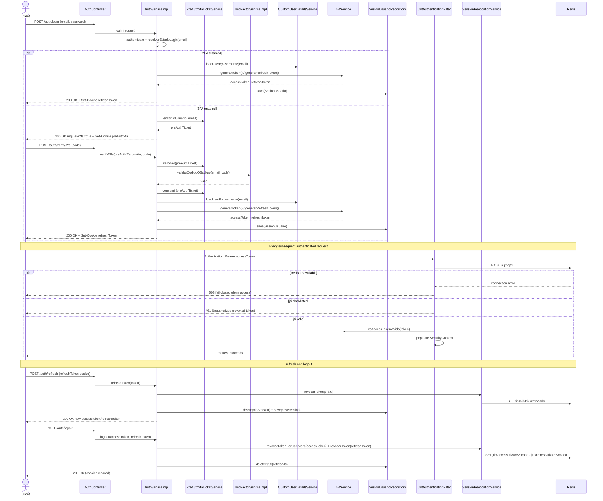
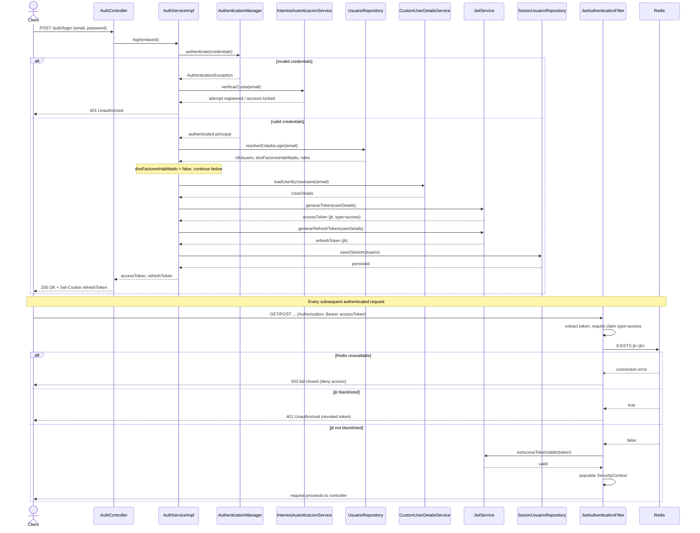
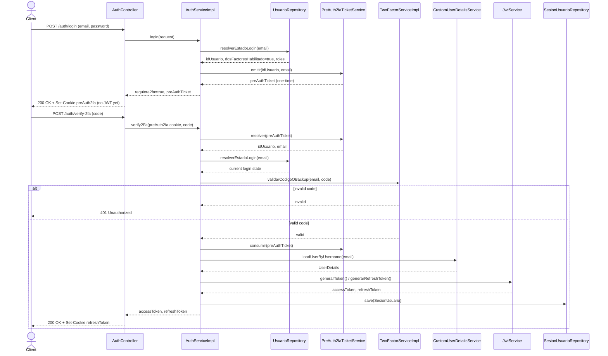
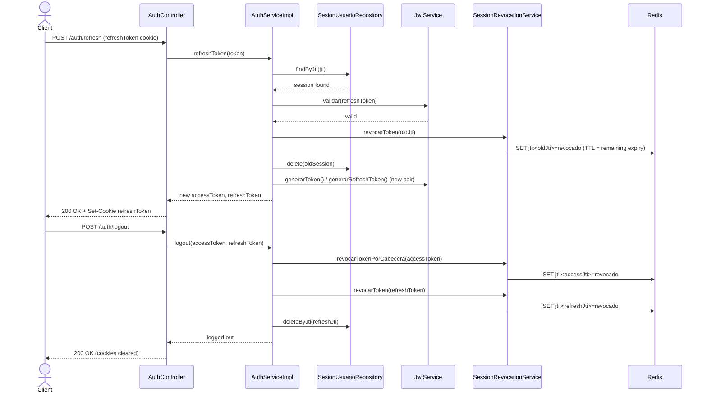

# Sequence Diagram - Login, 2FA and JWT Session Lifecycle (Artisync PFC)

This diagram traces the real login/authentication flow implemented in the backend,
based on the actual call chain (not a generic textbook flow):

- `AuthController.login()` / `verify2Fa()` / `refresh()` / `logout()` —
  `controller/seguridad/AuthController.java`
- `AuthServiceImpl` — `service/seguridad/impl/AuthServiceImpl.java`
- `TwoFactorServiceImpl.validarCodigoOBackup()` —
  `service/seguridad/impl/TwoFactorServiceImpl.java`
- `JwtAuthenticationFilter.doFilterInternal()` —
  `security/JwtAuthenticationFilter.java`
- `SessionRevocationService` — Redis-backed JWT blacklist with fail-closed behavior on
  Redis outage.

## 0. Combined flow (this is the diagram exported to `secuencia_login_jwt.png`)

---

## Detalle por escenario (referencia, no exportado como figura independiente)

### 1. Login without 2FA, and per-request JWT validation

## 2. Login with 2FA enabled

## 3. Refresh token and logout (session revocation)

