# Diagrama C4 Nivel 4: Código (Class Diagram) - Artisync PFC (Backend)

Este documento describe el **Nivel 4 (Código)** de la metodología **C4 Model** aplicado al componente de persistencia y dominio del backend de Artisync. Detalla la estructura interna orientada a objetos (Entidades JPA), sus atributos y multiplicidad de relaciones (agregación, composición, asociación). 

Como se definió en el **Nivel 3 (Componentes)**, estas clases pertenecen a la capa **ORM / Entidades JPA (`entity.*` + Hibernate)** del contenedor de la API REST, y representan el modelo de negocio central del sistema sobre el cual operan los Controladores y Servicios transaccionales.

## 1. Mapeo de Módulos (Namespaces) a Capas de Negocio

| Módulo / Paquete | Descripción y Responsabilidad en el Dominio |
| :--- | :--- |
| **security** | Implementa la base de control de acceso (RBAC), registro de `User`, 2FA, y gestión de sesiones delegadas. |
| **profile** | Gestiona los perfiles públicos de los creadores y su portafolio de trabajos verificados por IA. |
| **catalog** | Define la estructura de oferta de los creadores mediante la categorización y configuración de un `Offering` (Gig). |
| **order** | Orquesta el ciclo de vida central de un `Order` mediante máquinas de estado (`Workflow`) e incidencias (`RevisionTicket`). |
| **legal** | Formaliza la transacción financiera (`Contract`), el depósito en garantía (`EscrowPayment`), chat y la entrega final de archivos (`FinalDeliverable`). |
| **communication** | Sistema de notificaciones asíncronas, seguimiento (Follows), mensajería, onboarding de pedidos (`Briefing`) y moderación de contenido. |
| **social** | Interacciones de comunidad como calificaciones (`OfferingReview`) y sorteos promocionales (`Raffle`). |
| **audit** | Registra el rastro inmutable de auditoría de acciones sensibles del sistema (`AuditEvent`). |
| **backup** | Gestiona la programación y ejecución de respaldos de base de datos (`Backup`, `BackupSchedule`). |

---

## 2. Visualización con Mermaid (Renderizado Nativo)

A continuación se muestra el modelo estructural detallado. Debido a la magnitud del backend completo, puede que en algunas plataformas requieras desplazar o hacer zoom sobre el gráfico.

```mermaid
classDiagram
  direction LR

  namespace security {
    class Country {
      - countryId : Long
      - countryName : String
    }
    class User {
      - userId : Long
      - firstName : String
      - lastName : String
      - email : String
      - passwordHash : String
      - registrationDate : LocalDateTime
      - updatedAt : LocalDateTime
      - birthDate : LocalDate
    }
    class Role {
      - roleId : Long
      - roleName : String
      - roleDescription : String
    }
    class Permission {
      - permissionId : Long
      - permissionName : String
      - applicationModule : String
    }
    class UserRole {
      - userRoleId : Long
    }
    class UserSession {
      - sessionId : Long
      - jti : String
      - ipAddress : String
      - creationDate : LocalDateTime
      - expirationDate : LocalDateTime
    }
    class TwoFactorAuthentication {
      - twoFaId : Long
      - secretKey : String
    }
    class TwoFactorBackupCode {
      - codeId : Long
      - codeHash : String
    }
  }

  namespace audit {
    class AuditEvent {
      - auditEventId : Long
      - eventDate : LocalDateTime
      - actorUserId : Long
      - actorEmail : String
      - auditModule : String
      - auditAction : String
      - eventResult : String
      - affectedEntity : String
      - affectedEntityId : Long
      - errorMessage : String
      - ipAddress : String
    }
  }

  namespace profile {
    class CreatorProfile {
      - profileId : Long
      - biography : String
      - socialMediaUrl : String
    }
    class VerificationStatus {
      - verificationStatusId : Long
      - statusName : String
    }
    class AiCertificate {
      - certificateId : Long
      - documentS3Url : String
      - aiConfidenceScore : BigDecimal
      - analysisDate : LocalDateTime
    }
    class Portfolio {
      - portfolioId : Long
      - creationDate : LocalDateTime
    }
    class PortfolioItem {
      - portfolioItemId : Long
      - workTitle : String
      - workDescription : String
      - mediaFileUrl : String
      - uploadDate : LocalDateTime
    }
    class CreatorPaymentDetails {
      - paymentDetailsId : Long
      - paypalEmail : String
      - updateDate : LocalDateTime
    }
  }

  namespace catalog {
    class Category {
      - categoryId : Long
      - categoryName : String
    }
    class Subcategory {
      - subcategoryId : Long
      - subcategoryName : String
    }
    class Tag {
      - tagId : Long
      - tagName : String
    }
    class DynamicAttribute {
      - attributeId : Long
      - attributeName : String
      - dataType : String
    }
    class Offering {
      - offeringId : Long
      - title : String
      - detailedDescription : String
      - basePrice : BigDecimal
      - thumbnailUrl : String
    }
    class OfferingAttribute {
      - offeringAttributeId : Long
      - assignedValue : String
    }
    class OfferingTag {
      - offeringTagId : Long
    }
    class Workflow {
      - workflowId : Long
      - workflowName : String
      - workflowDescription : String
    }
  }

  namespace order {
    class WorkflowStage {
      - stageId : Long
      - stageName : String
    }
    class WorkflowStageConfig {
      - workflowStageId : Long
      - orderNumber : Integer
    }
    class Order {
      - orderId : Long
      - startDate : LocalDateTime
      - estimatedDeliveryDate : LocalDateTime
      - agreedPrice : BigDecimal
    }
    class OrderStatusHistory {
      - statusHistoryId : Long
      - transitionDate : LocalDateTime
      - remark : String
    }
    class RejectionReason {
      - reasonId : Long
      - reasonDescription : String
    }
    class RevisionTicket {
      - ticketId : Long
      - clientDescription : String
      - ticketStatus : String
      - creationDate : LocalDateTime
    }
    class ContractTemplate {
      - templateId : Long
      - legalVersion : String
      - templateHtmlBody : String
    }
    class Sketch {
      - sketchId : Long
      - imageUrl : String
      - uploadDate : LocalDateTime
    }
  }

  namespace legal {
    class Contract {
      - contractId : Long
      - clientSignatureHash : String
      - creatorSignatureHash : String
      - formalizationDate : LocalDateTime
      - pdfDocumentUrl : String
    }
    class EscrowPayment {
      - paymentId : Long
      - paypalOrderId : String
      - heldAmount : BigDecimal
    }
    class PaymentTransaction {
      - transactionId : Long
      - transactionType : String
      - amount : BigDecimal
      - executionDate : LocalDateTime
    }
    class ChatRoom {
      - roomId : Long
      - openDate : LocalDateTime
    }
    class Message {
      - messageId : Long
      - messageBody : String
      - sentAt : LocalDateTime
    }
    class FinalDeliverable {
      - deliverableId : Long
      - watermarkedVersionUrl : String
      - cleanVersionUrl : String
      - approvalStatus : String
      - deliveryDate : LocalDateTime
    }
    class RevisionTicketPayment {
      - ticketPaymentId : Long
      - paypalOrderId : String
      - approvalUrl : String
      - amount : BigDecimal
    }
    class WithdrawalRequest {
      - requestId : Long
      - requestedAmount : BigDecimal
      - destinationPaypalEmail : String
      - paypalPayoutId : String
      - requestDate : LocalDateTime
    }
  }

  namespace communication {
    class NotificationType {
      - notificationTypeId : Long
      - eventName : String
      - messageFormat : String
    }
    class SystemNotification {
      - notificationId : Long
      - issueDate : LocalDateTime
    }
    class Follower {
      - followId : Long
      - followDate : LocalDateTime
    }
    class BriefingTemplate {
      - briefingTemplateId : Long
      - templateName : String
      - creationDate : LocalDateTime
    }
    class BriefingQuestion {
      - questionId : Long
      - questionText : String
      - orderNumber : Integer
    }
    class SentBriefing {
      - sentBriefingId : Long
      - sentDate : LocalDateTime
    }
    class BriefingAnswer {
      - answerId : Long
      - answerText : String
      - answerDate : LocalDateTime
    }
    class PortfolioLike {
      - likeId : Long
      - likeDate : LocalDateTime
    }
    class PortfolioComment {
      - commentId : Long
      - commentText : String
      - publicationDate : LocalDateTime
    }
    class MessageViolation {
      - violationId : Long
      - originalMessage : String
      - detectedPattern : String
      - violationDate : LocalDateTime
    }
  }

  namespace social {
    class Raffle {
      - raffleId : Long
      - raffleTitle : String
      - prizesDescription : String
      - startDate : LocalDateTime
      - closeDate : LocalDateTime
    }
    class RaffleParticipant {
      - participationId : Long
      - registrationDate : LocalDateTime
      - prizeNotificationDate : LocalDateTime
    }
    class RafflePrize {
      - prizeId : Long
      - prizeDescription : String
      - order : Integer
    }
    class OfferingReview {
      - reviewId : Long
      - starRating : Integer
      - reviewText : String
      - reviewDate : LocalDateTime
    }
  }

  %% ---------- security ----------
  User "0..*" --> "1" Country : country
  User "1" --> "0..1" TwoFactorAuthentication : twoFactorAuth
  TwoFactorAuthentication "1" *-- "0..*" TwoFactorBackupCode : backupCodes
  User "1" *-- "0..*" UserSession : sessions
  User "1" --> "0..*" UserRole : assignments
  Role "1" --> "0..*" UserRole : assignments
  Role "0..*" -- "0..*" Permission : permissions

  %% ---------- profile ----------
  CreatorProfile "1" --> "1" User : user
  CreatorProfile "1" *-- "0..*" AiCertificate : certifications
  AiCertificate "0..*" --> "1" VerificationStatus : status
  CreatorProfile "1" *-- "0..1" Portfolio : portfolio
  Portfolio "1" *-- "0..*" PortfolioItem : items
  CreatorPaymentDetails "1" --> "1" User : user

  %% ---------- catalog ----------
  Category "1" *-- "0..*" Subcategory : subcategories
  Offering "0..*" --> "1" CreatorProfile : profile
  Offering "0..*" --> "1" Subcategory : subcategory
  Offering "1" --> "0..*" OfferingAttribute : attributes
  DynamicAttribute "1" --> "0..*" OfferingAttribute : attributes
  Offering "1" --> "0..*" OfferingTag : tags
  Tag "1" --> "0..*" OfferingTag : tags

  %% ---------- order ----------
  Workflow "1" *-- "0..*" WorkflowStageConfig : stageConfig
  WorkflowStage "1" --> "0..*" WorkflowStageConfig : stageConfig
  Order "0..*" --> "1" User : clientUser
  Order "0..*" --> "1" Offering : offering
  Order "0..*" --> "1" Workflow : workflow
  Order "1" *-- "0..*" OrderStatusHistory : history
  OrderStatusHistory "0..*" --> "1" WorkflowStage : stage
  Order "1" --> "0..*" RevisionTicket : tickets
  RevisionTicket "0..*" --> "1" RejectionReason : reason
  Order "1" --> "0..*" Sketch : sketches

  %% ---------- legal ----------
  Contract "1" --> "1" Order : order
  Contract "0..*" --> "1" ContractTemplate : template
  Contract "1" *-- "0..1" EscrowPayment : escrowGuarantee
  EscrowPayment "1" *-- "0..*" PaymentTransaction : transactions
  ChatRoom "1" --> "1" Order : order
  ChatRoom "1" *-- "0..*" Message : messages
  Message "0..*" --> "1" User : sender
  Order "1" --> "0..*" FinalDeliverable : deliverables
  RevisionTicket "1" --> "0..*" RevisionTicketPayment : payments
  User "1" --> "0..*" WithdrawalRequest : withdrawalRequests

  %% ---------- communication ----------
  SystemNotification "0..*" --> "1" User : user
  SystemNotification "0..*" --> "1" NotificationType : type
  Follower "0..*" --> "1" User : followerUser
  Follower "0..*" --> "1" CreatorProfile : creatorProfile
  BriefingTemplate "0..*" --> "1" CreatorProfile : creatorProfile
  BriefingTemplate "1" *-- "0..*" BriefingQuestion : questions
  SentBriefing "0..*" --> "1" Order : order
  SentBriefing "0..*" --> "1" BriefingTemplate : template
  SentBriefing "1" *-- "0..*" BriefingAnswer : answers
  BriefingAnswer "0..*" --> "1" BriefingQuestion : question
  PortfolioLike "0..*" --> "1" PortfolioItem : item
  PortfolioLike "0..*" --> "1" User : user
  PortfolioComment "0..*" --> "1" PortfolioItem : item
  PortfolioComment "0..*" --> "1" User : authorUser
  MessageViolation "0..*" --> "1" User : user
  MessageViolation "0..*" --> "1" Order : order

  %% ---------- social ----------
  Raffle "0..*" --> "1" CreatorProfile : creatorProfile
  Raffle "1" *-- "0..*" RaffleParticipant : participants
  RaffleParticipant "0..*" --> "1" User : user
  RafflePrize "0..*" --> "1" Raffle : raffle
  RaffleParticipant "0..*" --> "1" RafflePrize : prize
  OfferingReview "1" --> "1" Order : order
  OfferingReview "0..*" --> "1" User : author
```

---

## 3. Código PlantUML (Alternativa)

```plantuml
@startuml UML_Classes_Backend_Full
skinparam classAttributeIconSize 0
left to right direction

package "security" {
  class Country {
    - countryId : Long
    - countryName : String
  }
  class User {
    - userId : Long
    - firstName : String
    - lastName : String
    - email : String
    - passwordHash : String
    - registrationDate : LocalDateTime
    - updatedAt : LocalDateTime
    - birthDate : LocalDate
  }
  class Role {
    - roleId : Long
    - roleName : String
    - roleDescription : String
  }
  class Permission {
    - permissionId : Long
    - permissionName : String
    - applicationModule : String
  }
  class UserRole {
    - userRoleId : Long
  }
  class UserSession {
    - sessionId : Long
    - jti : String
    - ipAddress : String
    - creationDate : LocalDateTime
    - expirationDate : LocalDateTime
  }
  class TwoFactorAuthentication {
    - twoFaId : Long
    - secretKey : String
  }
  class TwoFactorBackupCode {
    - codeId : Long
    - codeHash : String
  }
}

package "audit" {
  class AuditEvent {
    - auditEventId : Long
    - eventDate : LocalDateTime
    - actorUserId : Long
    - actorEmail : String
    - auditModule : String
    - auditAction : String
    - eventResult : String
    - affectedEntity : String
    - affectedEntityId : Long
    - errorMessage : String
    - ipAddress : String
  }
}

package "profile" {
  class CreatorProfile {
    - profileId : Long
    - biography : String
    - socialMediaUrl : String
  }
  class VerificationStatus {
    - verificationStatusId : Long
    - statusName : String
  }
  class AiCertificate {
    - certificateId : Long
    - documentS3Url : String
    - aiConfidenceScore : BigDecimal
    - analysisDate : LocalDateTime
  }
  class Portfolio {
    - portfolioId : Long
    - creationDate : LocalDateTime
  }
  class PortfolioItem {
    - portfolioItemId : Long
    - workTitle : String
    - workDescription : String
    - mediaFileUrl : String
    - uploadDate : LocalDateTime
  }
  class CreatorPaymentDetails {
    - paymentDetailsId : Long
    - paypalEmail : String
    - updateDate : LocalDateTime
  }
}

package "catalog" {
  class Category {
    - categoryId : Long
    - categoryName : String
  }
  class Subcategory {
    - subcategoryId : Long
    - subcategoryName : String
  }
  class Tag {
    - tagId : Long
    - tagName : String
  }
  class DynamicAttribute {
    - attributeId : Long
    - attributeName : String
    - dataType : String
  }
  class Offering {
    - offeringId : Long
    - title : String
    - detailedDescription : String
    - basePrice : BigDecimal
    - thumbnailUrl : String
  }
  class OfferingAttribute {
    - offeringAttributeId : Long
    - assignedValue : String
  }
  class OfferingTag {
    - offeringTagId : Long
  }
  class Workflow {
    - workflowId : Long
    - workflowName : String
    - workflowDescription : String
  }
}

package "order" {
  class WorkflowStage {
    - stageId : Long
    - stageName : String
  }
  class WorkflowStageConfig {
    - workflowStageId : Long
    - orderNumber : Integer
  }
  class Order {
    - orderId : Long
    - startDate : LocalDateTime
    - estimatedDeliveryDate : LocalDateTime
    - agreedPrice : BigDecimal
  }
  class OrderStatusHistory {
    - statusHistoryId : Long
    - transitionDate : LocalDateTime
    - remark : String
  }
  class RejectionReason {
    - reasonId : Long
    - reasonDescription : String
  }
  class RevisionTicket {
    - ticketId : Long
    - clientDescription : String
    - ticketStatus : String
    - creationDate : LocalDateTime
  }
  class ContractTemplate {
    - templateId : Long
    - legalVersion : String
    - templateHtmlBody : String
  }
  class Sketch {
    - sketchId : Long
    - imageUrl : String
    - uploadDate : LocalDateTime
  }
}

package "legal" {
  class Contract {
    - contractId : Long
    - clientSignatureHash : String
    - creatorSignatureHash : String
    - formalizationDate : LocalDateTime
    - pdfDocumentUrl : String
  }
  class EscrowPayment {
    - paymentId : Long
    - paypalOrderId : String
    - heldAmount : BigDecimal
  }
  class PaymentTransaction {
    - transactionId : Long
    - transactionType : String
    - amount : BigDecimal
    - executionDate : LocalDateTime
  }
  class ChatRoom {
    - roomId : Long
    - openDate : LocalDateTime
  }
  class Message {
    - messageId : Long
    - messageBody : String
    - sentAt : LocalDateTime
  }
  class FinalDeliverable {
    - deliverableId : Long
    - watermarkedVersionUrl : String
    - cleanVersionUrl : String
    - approvalStatus : String
    - deliveryDate : LocalDateTime
  }
  class RevisionTicketPayment {
    - ticketPaymentId : Long
    - paypalOrderId : String
    - approvalUrl : String
    - amount : BigDecimal
  }
  class WithdrawalRequest {
    - requestId : Long
    - requestedAmount : BigDecimal
    - destinationPaypalEmail : String
    - paypalPayoutId : String
    - requestDate : LocalDateTime
  }
}

package "communication" {
  class NotificationType {
    - notificationTypeId : Long
    - eventName : String
    - messageFormat : String
  }
  class SystemNotification {
    - notificationId : Long
    - issueDate : LocalDateTime
  }
  class Follower {
    - followId : Long
    - followDate : LocalDateTime
  }
  class BriefingTemplate {
    - briefingTemplateId : Long
    - templateName : String
    - creationDate : LocalDateTime
  }
  class BriefingQuestion {
    - questionId : Long
    - questionText : String
    - orderNumber : Integer
  }
  class SentBriefing {
    - sentBriefingId : Long
    - sentDate : LocalDateTime
  }
  class BriefingAnswer {
    - answerId : Long
    - answerText : String
    - answerDate : LocalDateTime
  }
  class PortfolioLike {
    - likeId : Long
    - likeDate : LocalDateTime
  }
  class PortfolioComment {
    - commentId : Long
    - commentText : String
    - publicationDate : LocalDateTime
  }
  class MessageViolation {
    - violationId : Long
    - originalMessage : String
    - detectedPattern : String
    - violationDate : LocalDateTime
  }
}

package "social" {
  class Raffle {
    - raffleId : Long
    - raffleTitle : String
    - prizesDescription : String
    - startDate : LocalDateTime
    - closeDate : LocalDateTime
  }
  class RaffleParticipant {
    - participationId : Long
    - registrationDate : LocalDateTime
    - prizeNotificationDate : LocalDateTime
  }
  class RafflePrize {
    - prizeId : Long
    - prizeDescription : String
    - order : Integer
  }
  class OfferingReview {
    - reviewId : Long
    - starRating : Integer
    - reviewText : String
    - reviewDate : LocalDateTime
  }
}

' ---------- security ----------
User "0..*" --> "1" Country : country
User "1" --> "0..1" TwoFactorAuthentication : twoFactorAuth
TwoFactorAuthentication "1" *-- "0..*" TwoFactorBackupCode : backupCodes
User "1" *-- "0..*" UserSession : sessions
User "1" --> "0..*" UserRole : assignments
Role "1" --> "0..*" UserRole : assignments
Role "0..*" -- "0..*" Permission : permissions

' ---------- profile ----------
CreatorProfile "1" --> "1" User : user
CreatorProfile "1" *-- "0..*" AiCertificate : certifications
AiCertificate "0..*" --> "1" VerificationStatus : status
CreatorProfile "1" *-- "0..1" Portfolio : portfolio
Portfolio "1" *-- "0..*" PortfolioItem : items
CreatorPaymentDetails "1" --> "1" User : user

' ---------- catalog ----------
Category "1" *-- "0..*" Subcategory : subcategories
Offering "0..*" --> "1" CreatorProfile : profile
Offering "0..*" --> "1" Subcategory : subcategory
Offering "1" --> "0..*" OfferingAttribute : attributes
DynamicAttribute "1" --> "0..*" OfferingAttribute : attributes
Offering "1" --> "0..*" OfferingTag : tags
Tag "1" --> "0..*" OfferingTag : tags

' ---------- order ----------
Workflow "1" *-- "0..*" WorkflowStageConfig : stageConfig
WorkflowStage "1" --> "0..*" WorkflowStageConfig : stageConfig
Order "0..*" --> "1" User : clientUser
Order "0..*" --> "1" Offering : offering
Order "0..*" --> "1" Workflow : workflow
Order "1" *-- "0..*" OrderStatusHistory : history
OrderStatusHistory "0..*" --> "1" WorkflowStage : stage
Order "1" --> "0..*" RevisionTicket : tickets
RevisionTicket "0..*" --> "1" RejectionReason : reason
Order "1" --> "0..*" Sketch : sketches

' ---------- legal ----------
Contract "1" --> "1" Order : order
Contract "0..*" --> "1" ContractTemplate : template
Contract "1" *-- "0..1" EscrowPayment : escrowGuarantee
EscrowPayment "1" *-- "0..*" PaymentTransaction : transactions
ChatRoom "1" --> "1" Order : order
ChatRoom "1" *-- "0..*" Message : messages
Message "0..*" --> "1" User : sender
Order "1" --> "0..*" FinalDeliverable : deliverables
RevisionTicket "1" --> "0..*" RevisionTicketPayment : payments
User "1" --> "0..*" WithdrawalRequest : withdrawalRequests

' ---------- communication ----------
SystemNotification "0..*" --> "1" User : user
SystemNotification "0..*" --> "1" NotificationType : type
Follower "0..*" --> "1" User : followerUser
Follower "0..*" --> "1" CreatorProfile : creatorProfile
BriefingTemplate "0..*" --> "1" CreatorProfile : creatorProfile
BriefingTemplate "1" *-- "0..*" BriefingQuestion : questions
SentBriefing "0..*" --> "1" Order : order
SentBriefing "0..*" --> "1" BriefingTemplate : template
SentBriefing "1" *-- "0..*" BriefingAnswer : answers
BriefingAnswer "0..*" --> "1" BriefingQuestion : question
PortfolioLike "0..*" --> "1" PortfolioItem : item
PortfolioLike "0..*" --> "1" User : user
PortfolioComment "0..*" --> "1" PortfolioItem : item
PortfolioComment "0..*" --> "1" User : authorUser
MessageViolation "0..*" --> "1" User : user
MessageViolation "0..*" --> "1" Order : order

' ---------- social ----------
Raffle "0..*" --> "1" CreatorProfile : creatorProfile
Raffle "1" *-- "0..*" RaffleParticipant : participants
RaffleParticipant "0..*" --> "1" User : user
RafflePrize "0..*" --> "1" Raffle : raffle
RaffleParticipant "0..*" --> "1" RafflePrize : prize
OfferingReview "1" --> "1" Order : order
OfferingReview "0..*" --> "1" User : author

@enduml
```

---

## 4. Historial de Decisiones / Refinamientos del Modelo

Las siguientes decisiones de diseño a nivel de código se tomaron para soportar la arquitectura definida en el Nivel 3 (Componentes):

| # | Decisión Arquitectónica / Modificación al Modelo Base | Justificación Técnica en el Nivel 4 (Persistencia) |
|---|---|---|
| 1 | Multiplicidad explícita (`1`, `0..1`, `0..*`) | Requerido para mapear correctamente relaciones JPA bidireccionales y unidireccionales (`@OneToMany`, `@ManyToOne`). |
| 2 | Uso de Composición (`*--`) en dependencias estrictas | Para modelar la propagación de operaciones en cascada (`CascadeType.ALL`, `orphanRemoval=true`). Ej: `ChatRoom *-- Message`, `Order *-- OrderStatusHistory`. |
| 3 | Auditoría y Trazabilidad inmutable | Añadidos atributos explícitos de auditoría (`author` en Reviews, `sender` en Messages) necesarios para validar permisos de acceso y roles en los Interceptores de Seguridad del Nivel 3. |
| 4 | Atributos de Estado y Temporalidad | Campos temporales y de estado (`ticketStatus`, `fechaResolucion`, `approvalStatus`) añadidos para posibilitar el procesamiento asíncrono y los Webhooks (p. ej. validaciones de pagos en Escrow). |
| 5 | Cambio de tipos de datos base (`Integer` a `Long`) | Ajuste en campos de metadatos para soportar archivos multimedia de alta calidad almacenados en Cloud Storage / CDN. |
