# Diagramas de Casos de Uso (UML) - Proyecto Artisync

A partir del análisis del esquema de base de datos (`V1__schema_inicial.sql`), se han identificado 7 módulos principales en el sistema. A continuación se presenta un diagrama general del sistema y posteriormente 2 diagramas de casos de uso de alto nivel por cada módulo utilizando sintaxis de Mermaid.

---

## Diagrama de Casos de Uso General

Este diagrama ilustra la interacción de los actores principales (Administrador, Creador, Cliente, Moderador, Soporte y Auditor) con los grandes macro-procesos o subsistemas de la plataforma Artisync.

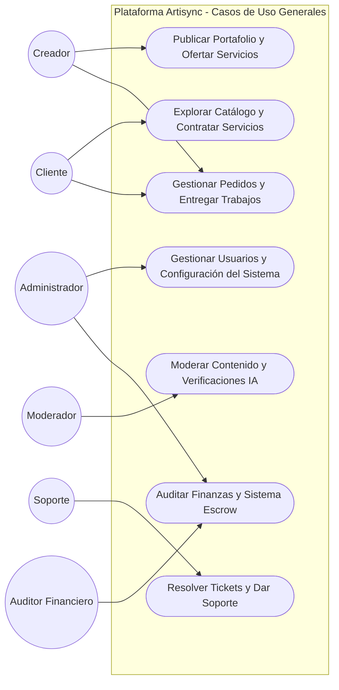
```mermaid
flowchart LR
    %% Actores Principales
    Admin((Administrador))
    Creador((Creador))
    Cliente((Cliente))
    Moderador((Moderador))
    Soporte((Soporte))
    Auditor((Auditor Financiero))

    %% Casos de Uso Globales
    subgraph Artisync [Plataforma Artisync - Casos de Uso Generales]
        UC1([Gestionar Usuarios y Configuración del Sistema])
        UC2([Publicar Portafolio y Ofertar Servicios])
        UC3([Explorar Catálogo y Contratar Servicios])
        UC4([Gestionar Pedidos y Entregar Trabajos])
        UC5([Moderar Contenido y Verificaciones IA])
        UC6([Resolver Tickets y Dar Soporte])
        UC7([Auditar Finanzas y Sistema Escrow])
    end

    %% Relaciones
    Admin --> UC1
    Admin --> UC7

    Creador --> UC2
    Creador --> UC4

    Cliente --> UC3
    Cliente --> UC4

    Moderador --> UC5

    Soporte --> UC6

    Auditor --> UC7
```

---

## Módulo 1: Seguridad y Control de Acceso

### Diagrama 1: Gestión de Identidad y Autenticación
Representa las acciones fundamentales que cualquier usuario realiza para acceder al sistema y asegurar su cuenta.

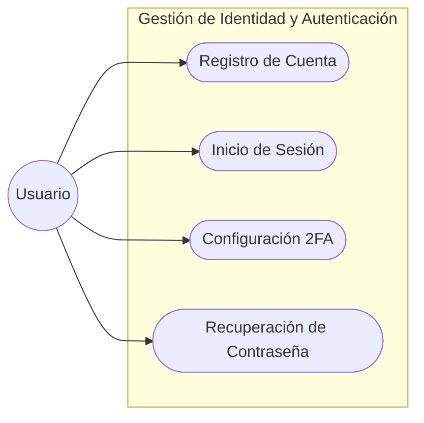
```mermaid
flowchart LR
    Usuario((Usuario))
    
    subgraph Autenticacion [Gestión de Identidad y Autenticación]
        UC1([Registro de Cuenta])
        UC2([Inicio de Sesión])
        UC3([Configuración 2FA])
        UC4([Recuperación de Contraseña])
    end
    
    Usuario --> UC1
    Usuario --> UC2
    Usuario --> UC3
    Usuario --> UC4
```

### Diagrama 2: Control de Acceso y Sesiones
Ilustra cómo los perfiles administrativos gestionan los privilegios y accesos en el sistema.

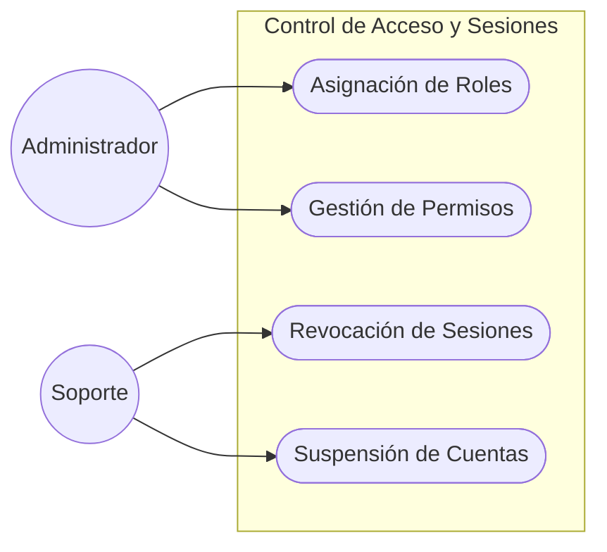
```mermaid
flowchart LR
    Soporte((Soporte))
    Admin((Administrador))
    
    subgraph ControlAcceso [Control de Acceso y Sesiones]
        UC1([Asignación de Roles])
        UC2([Gestión de Permisos])
        UC3([Revocación de Sesiones])
        UC4([Suspensión de Cuentas])
    end
    
    Admin --> UC1
    Admin --> UC2
    Soporte --> UC3
    Soporte --> UC4
```

---

## Módulo 2: Perfiles, Verificación y Portafolio

### Diagrama 1: Gestión de Perfil y Habilidades
Acciones del creador para configurar su perfil público y demostrar sus aptitudes.

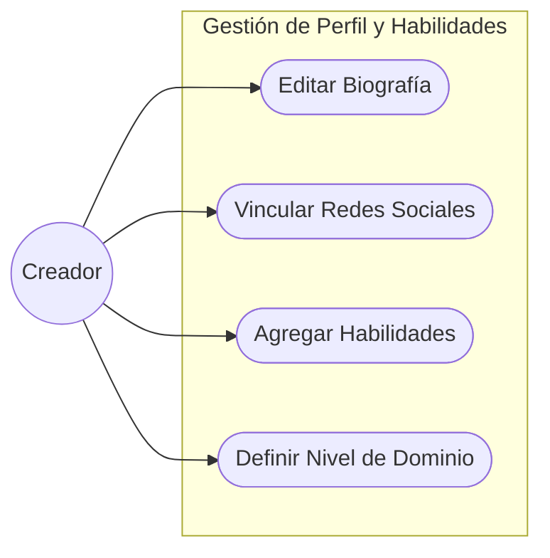
```mermaid
flowchart LR
    Creador((Creador))
    
    subgraph Perfil [Gestión de Perfil y Habilidades]
        UC1([Editar Biografía])
        UC2([Vincular Redes Sociales])
        UC3([Agregar Habilidades])
        UC4([Definir Nivel de Dominio])
    end
    
    Creador --> UC1
    Creador --> UC2
    Creador --> UC3
    Creador --> UC4
```

### Diagrama 2: Portafolio y Verificación IA
Proceso en el que un creador sube contenido y solicita la validación de sus obras mediante Inteligencia Artificial y un Moderador humano.

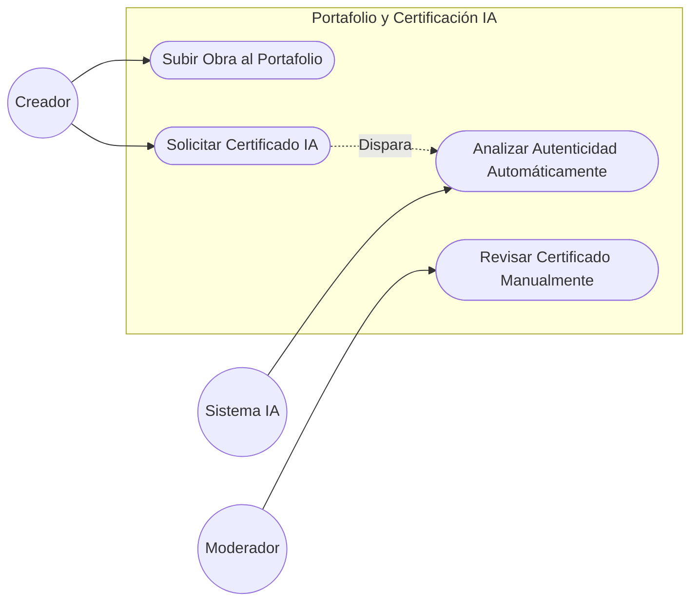
```mermaid
flowchart LR
    Creador((Creador))
    Moderador((Moderador))
    SistemaIA((Sistema IA))
    
    subgraph Portafolio [Portafolio y Certificación IA]
        UC1([Subir Obra al Portafolio])
        UC2([Solicitar Certificado IA])
        UC3([Analizar Autenticidad Automáticamente])
        UC4([Revisar Certificado Manualmente])
    end
    
    Creador --> UC1
    Creador --> UC2
    UC2 -.->|Dispara| UC3
    SistemaIA --> UC3
    Moderador --> UC4
```

---

## Módulo 3: Catálogo Dinámico de Servicios

### Diagrama 1: Gestión Estructural del Catálogo
Define cómo el equipo de administración prepara la estructura donde se albergarán los servicios.

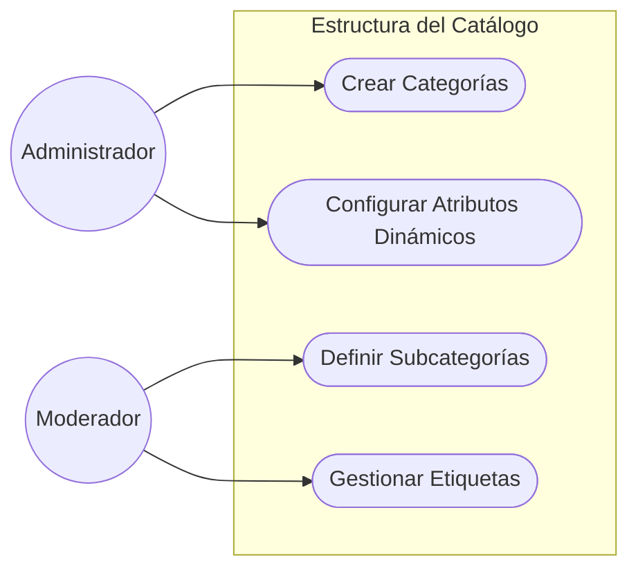
```mermaid
flowchart LR
    Admin((Administrador))
    Moderador((Moderador))
    
    subgraph EstructuraCatalogo [Estructura del Catálogo]
        UC1([Crear Categorías])
        UC2([Definir Subcategorías])
        UC3([Configurar Atributos Dinámicos])
        UC4([Gestionar Etiquetas])
    end
    
    Admin --> UC1
    Admin --> UC3
    Moderador --> UC2
    Moderador --> UC4
```

### Diagrama 2: Oferta y Exploración de Servicios
Interacción de Creadores y Clientes con los servicios publicados en la plataforma.

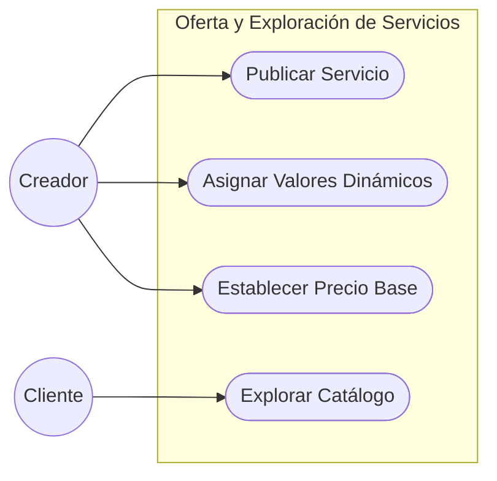
```mermaid
flowchart LR
    Creador((Creador))
    Cliente((Cliente))
    
    subgraph Servicios [Oferta y Exploración de Servicios]
        UC1([Publicar Servicio])
        UC2([Asignar Valores Dinámicos])
        UC3([Establecer Precio Base])
        UC4([Explorar Catálogo])
    end
    
    Creador --> UC1
    Creador --> UC2
    Creador --> UC3
    Cliente --> UC4
```

---

## Módulo 4: Motor de Flujos de Trabajo y Pedidos

### Diagrama 1: Configuración de Flujos
Preparación de los pasos que debe seguir un pedido desde su inicio hasta la entrega.

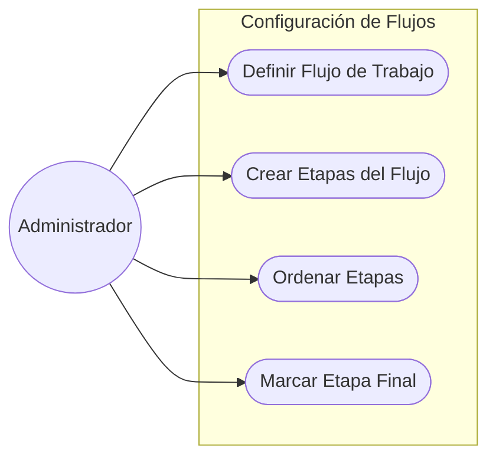
```mermaid
flowchart LR
    Admin((Administrador))
    
    subgraph FlujosTrabajo [Configuración de Flujos]
        UC1([Definir Flujo de Trabajo])
        UC2([Crear Etapas del Flujo])
        UC3([Ordenar Etapas])
        UC4([Marcar Etapa Final])
    end
    
    Admin --> UC1
    Admin --> UC2
    Admin --> UC3
    Admin --> UC4
```

### Diagrama 2: Ejecución de Pedidos y Revisión
Ciclo de vida operativo de un pedido entre el Cliente y el Creador, con intervención de Soporte en caso de disputas.

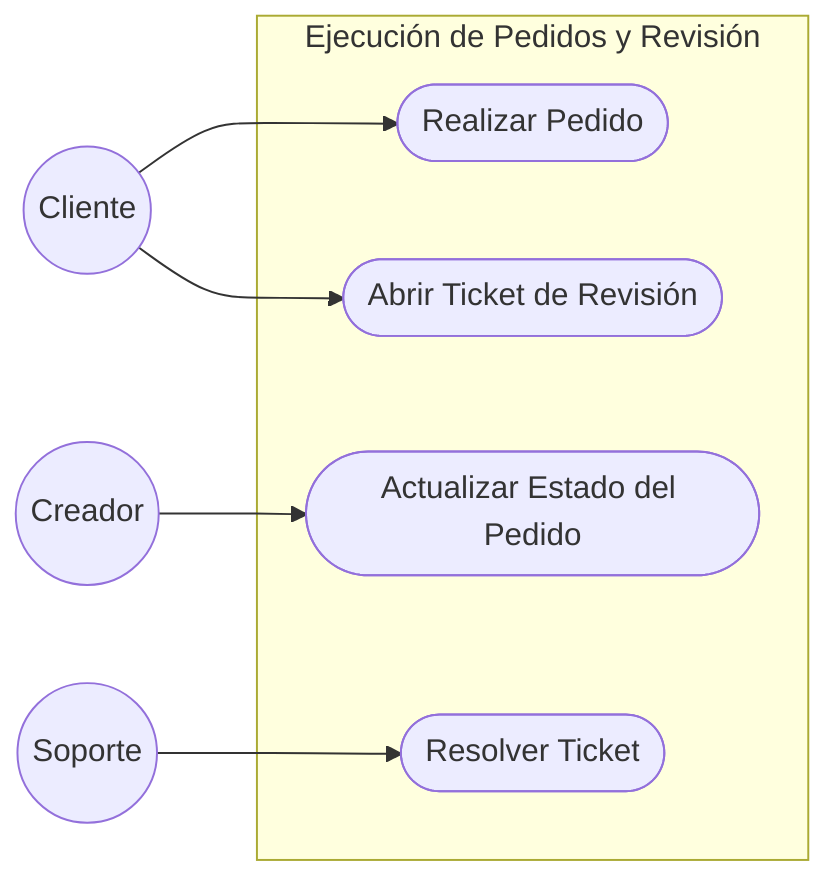
```mermaid
flowchart LR
    Cliente((Cliente))
    Creador((Creador))
    Soporte((Soporte))
    
    subgraph GestionPedidos [Ejecución de Pedidos y Revisión]
        UC1([Realizar Pedido])
        UC2([Actualizar Estado del Pedido])
        UC3([Abrir Ticket de Revisión])
        UC4([Resolver Ticket])
    end
    
    Cliente --> UC1
    Creador --> UC2
    Cliente --> UC3
    Soporte --> UC4
```

---

## Módulo 5: Legal, Entregables y Finanzas (Escrow)

### Diagrama 1: Gestión Contractual y Entregables
Manejo de acuerdos y entrega de archivos definitivos ligados al pedido.

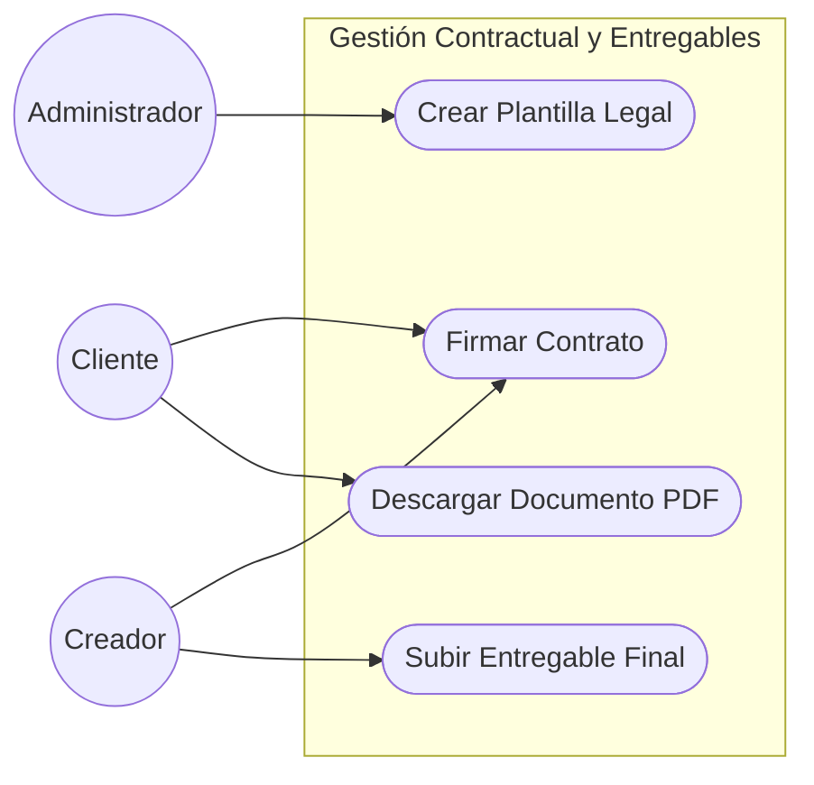
```mermaid
flowchart LR
    Cliente((Cliente))
    Creador((Creador))
    Admin((Administrador))
    
    subgraph Contratos [Gestión Contractual y Entregables]
        UC1([Crear Plantilla Legal])
        UC2([Firmar Contrato])
        UC3([Subir Entregable Final])
        UC4([Descargar Documento PDF])
    end
    
    Admin --> UC1
    Cliente --> UC2
    Creador --> UC2
    Creador --> UC3
    Cliente --> UC4
```

### Diagrama 2: Sistema Escrow y Finanzas
Flujo financiero que garantiza la seguridad del dinero para ambas partes.

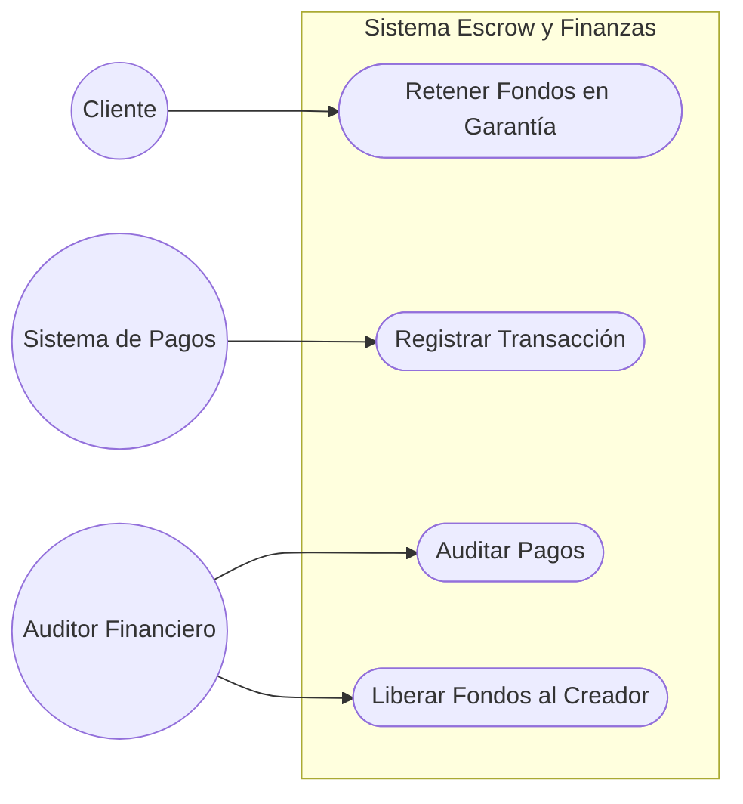
```mermaid
flowchart LR
    Cliente((Cliente))
    Auditor((Auditor Financiero))
    Sistema((Sistema de Pagos))
    
    subgraph Finanzas [Sistema Escrow y Finanzas]
        UC1([Retener Fondos en Garantía])
        UC2([Registrar Transacción])
        UC3([Auditar Pagos])
        UC4([Liberar Fondos al Creador])
    end
    
    Cliente --> UC1
    Sistema --> UC2
    Auditor --> UC3
    Auditor --> UC4
```

---

## Módulo 6: Comunicación y Notificaciones

### Diagrama 1: Sistema de Chat Interno
Manejo de los canales de comunicación durante la ejecución de un pedido.

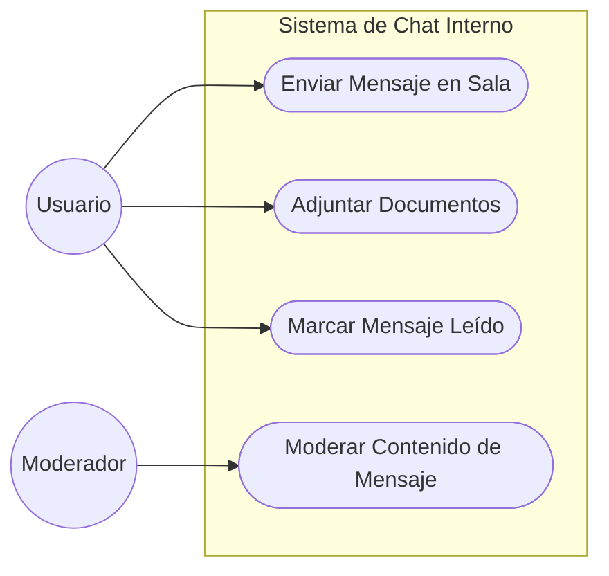
```mermaid
flowchart LR
    Usuario((Usuario))
    Moderador((Moderador))
    
    subgraph Chat [Sistema de Chat Interno]
        UC1([Enviar Mensaje en Sala])
        UC2([Adjuntar Documentos])
        UC3([Marcar Mensaje Leído])
        UC4([Moderar Contenido de Mensaje])
    end
    
    Usuario --> UC1
    Usuario --> UC2
    Usuario --> UC3
    Moderador --> UC4
```

### Diagrama 2: Notificaciones e Infracciones
Generación de alertas para los usuarios y control de comportamientos indebidos detectados por el sistema.

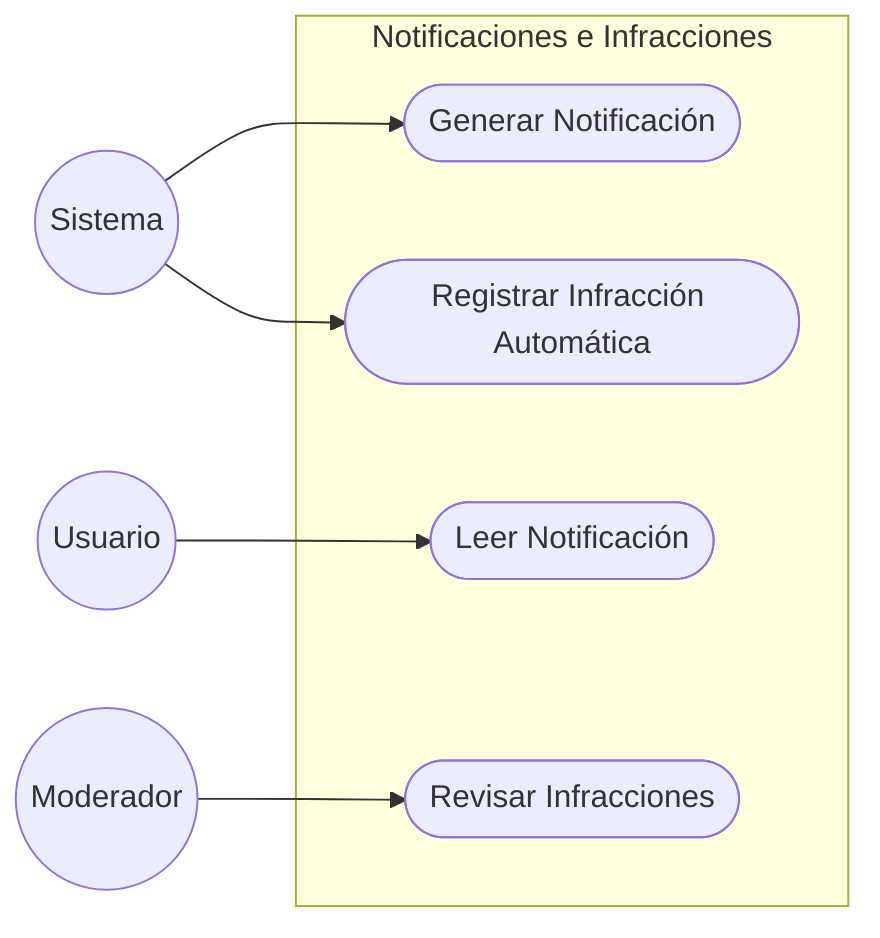
```mermaid
flowchart LR
    Sistema((Sistema))
    Moderador((Moderador))
    Usuario((Usuario))
    
    subgraph Alertas [Notificaciones e Infracciones]
        UC1([Generar Notificación])
        UC2([Leer Notificación])
        UC3([Registrar Infracción Automática])
        UC4([Revisar Infracciones])
    end
    
    Sistema --> UC1
    Usuario --> UC2
    Sistema --> UC3
    Moderador --> UC4
```

---

## Módulo 7: Social, Comunidad y Sorteos

### Diagrama 1: Interacción Comunitaria
Actividades sociales que ayudan al posicionamiento de los creadores en la plataforma.

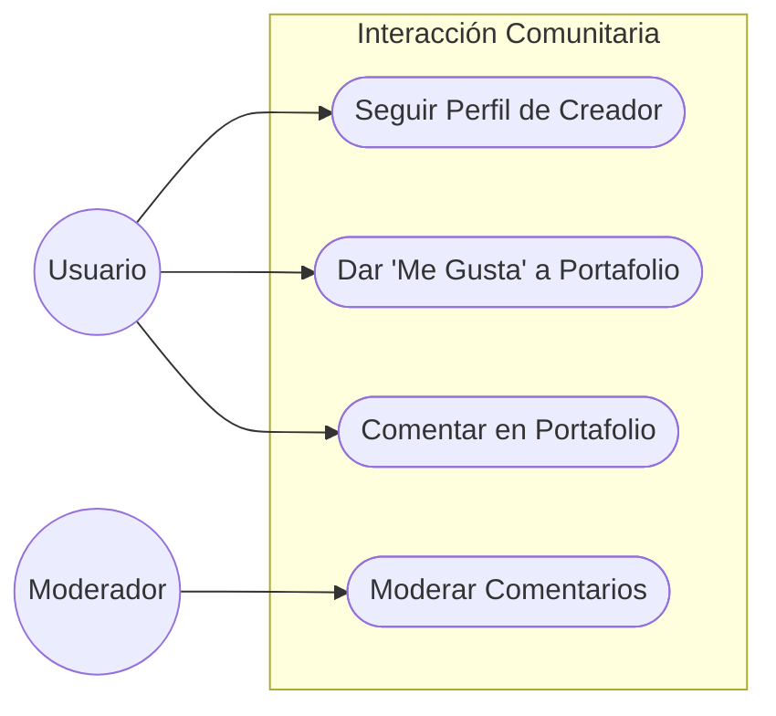
```mermaid
flowchart LR
    Usuario((Usuario))
    Moderador((Moderador))
    
    subgraph Social [Interacción Comunitaria]
        UC1([Seguir Perfil de Creador])
        UC2([Dar 'Me Gusta' a Portafolio])
        UC3([Comentar en Portafolio])
        UC4([Moderar Comentarios])
    end
    
    Usuario --> UC1
    Usuario --> UC2
    Usuario --> UC3
    Moderador --> UC4
```

### Diagrama 2: Gestión de Sorteos
Proceso de creación y participación en eventos promocionales generados por los creadores.

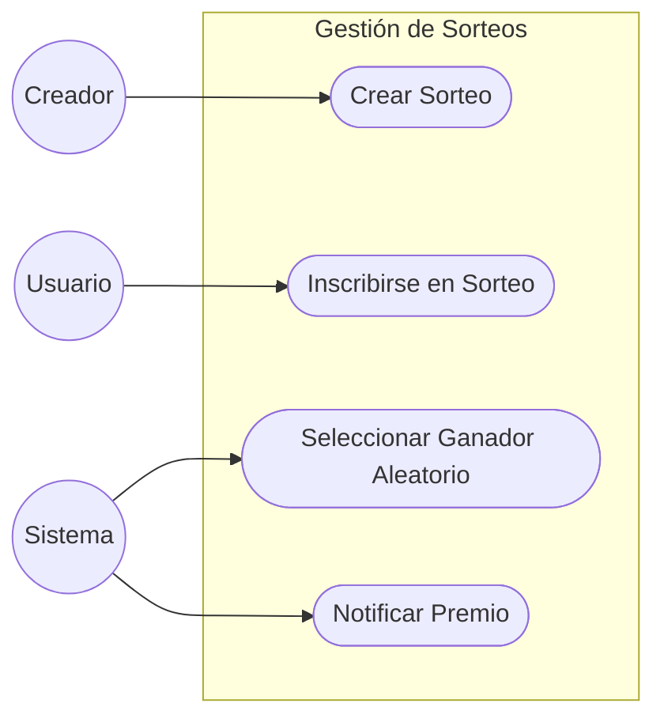
```mermaid
flowchart LR
    Creador((Creador))
    Usuario((Usuario))
    Sistema((Sistema))
    
    subgraph Sorteos [Gestión de Sorteos]
        UC1([Crear Sorteo])
        UC2([Inscribirse en Sorteo])
        UC3([Seleccionar Ganador Aleatorio])
        UC4([Notificar Premio])
    end
    
    Creador --> UC1
    Usuario --> UC2
    Sistema --> UC3
    Sistema --> UC4
```
