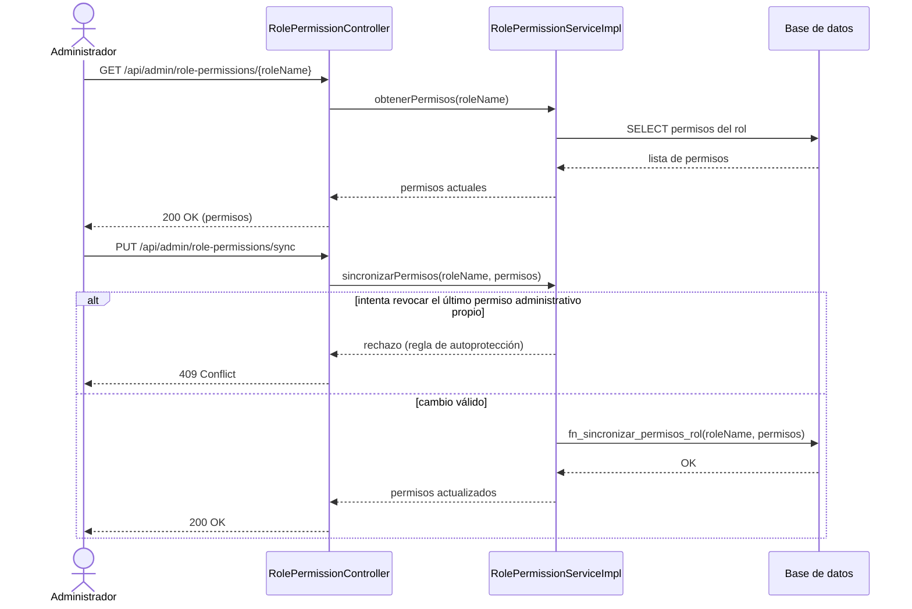
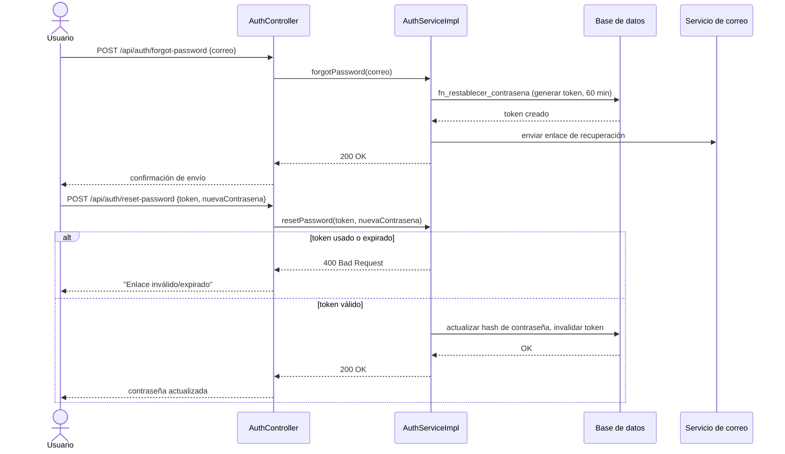

# Casos de Uso — Módulo Seguridad y Control de Acceso

Plantilla de Cockburn con los cuatro niveles de precisión exigidos: (1) nombre del actor principal y objetivo, (2) escenario principal de éxito, (3) condiciones de extensión, (4) pasos de manejo de extensión.

> **Convención de trazabilidad (aplica a las seis colecciones de casos de uso).** Cada caso declara dos campos bajo su título:
>
> - **Trazabilidad:** el requisito del SRS y la historia de usuario que le corresponden.
> - **Prueba de integración:** la prueba automatizada que ejercita el flujo, tomada de la columna `prueba_automatizada` de [`docs/trazabilidad/matriz.csv`](../../trazabilidad/matriz.csv). Cuando un requisito no tiene prueba, el campo lo dice explícitamente en vez de omitirse.
>
> **Trazabilidad a diagrama de secuencia:** 6 de los 23 casos de uso tienen diagrama de secuencia propio: CU-03 (`docs/diagramas/secuencia_login_jwt.png`) y, embebidos como Mermaid junto a su caso, CU-02, CU-04, CU-13, CU-17 y CU-20 — priorizados por ser requisitos Must que cubren dominios distintos (roles, recuperación de cuenta, catálogo, contrato, pago). Los 17 casos restantes no tienen diagrama al que trazarse todavía; se declara como brecha conocida en lugar de enlazar a diagramas que no existen.

---

## CU-01: Registrarse en la plataforma
**Trazabilidad:** REQ-F-001 / HU-01
**Prueba de integración:** `AuthServiceImplTest`

**1. Actor principal y objetivo:** Visitante — crear una cuenta con un rol definido (Creador o Cliente).

**Nivel:** Meta de usuario (sea level)

**Precondición:** El visitante no tiene sesión activa.

**Garantía de éxito:** La cuenta queda creada con el rol elegido y las credenciales almacenadas de forma segura (bcrypt).

**2. Escenario principal de éxito:**
1. El visitante accede al formulario de registro.
2. El sistema solicita nombre, correo, contraseña y rol (Creador o Cliente).
3. El visitante completa el formulario y lo envía.
4. El sistema valida el formato de correo y la fortaleza de la contraseña.
5. El sistema hashea la contraseña con bcrypt y crea la cuenta con el rol seleccionado.
6. El sistema envía correo de confirmación y redirige al visitante a su panel según el rol.

**3. Extensiones (condiciones):**
- 4a. El correo ya está registrado.
- 4b. La contraseña no cumple la política mínima de seguridad.

**4. Manejo de extensiones:**
- 4a1. El sistema muestra "Este correo ya está registrado" y ofrece el flujo de recuperación de contraseña. Termina.
- 4b1. El sistema muestra los requisitos de contraseña no cumplidos y solicita reingresar. Vuelve al paso 3.

---

## CU-02: Gestionar permisos de un rol
**Trazabilidad:** REQ-F-002 / HU-02
**Prueba de integración:** `RolePermissionControllerTest` · `RolePermissionServiceImplTest`

**1. Actor principal y objetivo:** Administrador — asignar o revocar un permiso a un rol del sistema.

**Nivel:** Meta de usuario

**Precondición:** El administrador tiene sesión activa con permiso de gestión de roles.

**Garantía de éxito:** El permiso queda asignado/revocado y surte efecto en la siguiente solicitud de cualquier usuario con ese rol.

**2. Escenario principal de éxito:**
1. El administrador abre el panel de gestión de roles.
2. El sistema muestra los roles existentes y sus permisos actuales.
3. El administrador selecciona un rol y activa o desactiva un permiso específico.
4. El sistema persiste el cambio en la relación rol-permiso.
5. El sistema confirma el cambio al administrador.

**3. Extensiones:**
- 3a. El administrador intenta revocar el último permiso administrativo de su propio rol.

**4. Manejo de extensiones:**
- 3a1. El sistema rechaza la operación para evitar que el administrador se bloquee a sí mismo, y muestra un mensaje explicativo. Vuelve al paso 3.

### Diagrama de secuencia

---

## CU-03: Iniciar sesión
**Trazabilidad:** REQ-F-003 / HU-03
**Prueba de integración:** `JwtAuthenticationFilterTest` · `JwtServiceTest` · `AuthRateLimitFilterTest` · `AuthControllerTest`

**1. Actor principal y objetivo:** Usuario registrado — obtener un token de sesión válido para acceder a rutas protegidas.

**Nivel:** Meta de usuario

**Precondición:** El usuario tiene una cuenta activa.

**Garantía de éxito:** El usuario recibe un JWT firmado en una cookie HttpOnly+Secure+SameSite=Strict, válido por 24 horas.

**2. Escenario principal de éxito:**
1. El usuario ingresa correo y contraseña.
2. El sistema valida las credenciales contra el hash almacenado.
3. Si el usuario tiene 2FA activo, el sistema solicita el código TOTP (ver CU-05).
4. El sistema emite el JWT firmado y lo coloca en una cookie HttpOnly.
5. El usuario es redirigido a su panel según su rol.

**3. Extensiones:**
- 2a. Las credenciales son incorrectas.
- 4a. El token generado corresponde a una cuenta suspendida.

**4. Manejo de extensiones:**
- 2a1. El sistema responde 401 "Credenciales inválidas" sin especificar cuál campo es incorrecto. Termina.
- 4a1. El sistema no emite el token y muestra el motivo de la suspensión. Termina.

---

## CU-04: Recuperar contraseña olvidada
**Trazabilidad:** REQ-F-004 / HU-04
**Prueba de integración:** `AuthServiceImplTest#forgotPassword_ShouldSendEmail_WhenUsuarioExiste` · `AuthServiceImplTest#resetPassword_ShouldUpdatePassword_WhenTokenValido` · `AuthServiceImplTest#resetPassword_ShouldThrowBadRequest_WhenTokenExpirado`

**1. Actor principal y objetivo:** Usuario registrado — restablecer su contraseña mediante un enlace enviado por correo.

**Nivel:** Meta de usuario

**Precondición:** El usuario conoce el correo asociado a su cuenta.

**Garantía de éxito:** La contraseña queda actualizada y el usuario puede iniciar sesión con la nueva.

**2. Escenario principal de éxito:**
1. El usuario solicita recuperación de contraseña ingresando su correo.
2. El sistema genera un token de un solo uso válido por 60 minutos y lo envía por correo.
3. El usuario abre el enlace y define una nueva contraseña.
4. El sistema valida el token, actualiza el hash de la contraseña y lo invalida para reutilización.
5. El sistema confirma el cambio y permite el inicio de sesión inmediato.

**3. Extensiones:**
- 3a. El token ya fue usado previamente.
- 3b. El token expiró (más de 60 minutos).

**4. Manejo de extensiones:**
- 3a1. El sistema muestra "Enlace inválido" y ofrece generar uno nuevo. Termina.
- 3b1. El sistema muestra "Enlace expirado" y ofrece generar uno nuevo. Termina.

### Diagrama de secuencia

---

## CU-05: Verificar código 2FA al iniciar sesión
**Trazabilidad:** REQ-F-005 / HU-05
**Prueba de integración:** `TwoFactorServiceImplTest` · `PreAuth2faTicketServiceTest`

**1. Actor principal y objetivo:** Creador con identidad verificada — completar el segundo factor de autenticación para iniciar sesión.

**Nivel:** Subfunción (invocado desde CU-03)

**Precondición:** El usuario tiene 2FA activado y ya superó la validación de contraseña.

**Garantía de éxito:** El sistema emite el JWT solo tras validar el código TOTP.

**2. Escenario principal de éxito:**
1. El sistema solicita el código TOTP de 6 dígitos.
2. El usuario ingresa el código generado por su aplicación autenticadora.
3. El sistema valida el código contra la ventana de tiempo vigente.
4. El sistema emite el JWT y completa el inicio de sesión (continúa en CU-03, paso 4).

**3. Extensiones:**
- 3a. El código es incorrecto o la ventana de tiempo expiró.

**4. Manejo de extensiones:**
- 3a1. El sistema responde "Código inválido o expirado" y permite un nuevo intento, con límite de intentos por minuto. Vuelve al paso 2.
